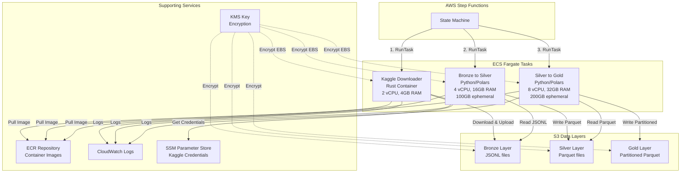
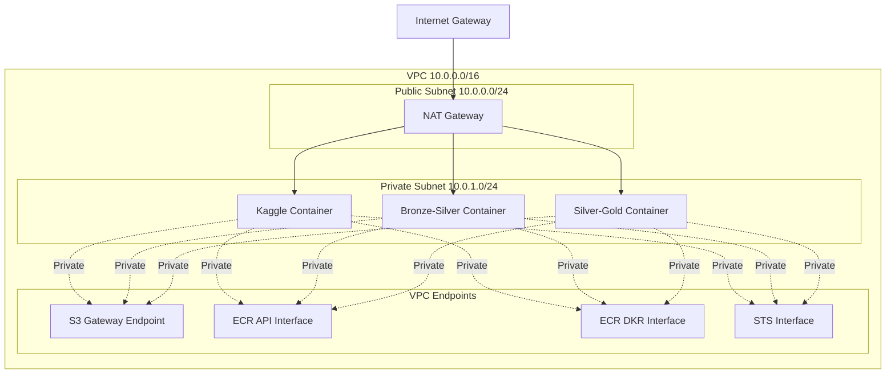
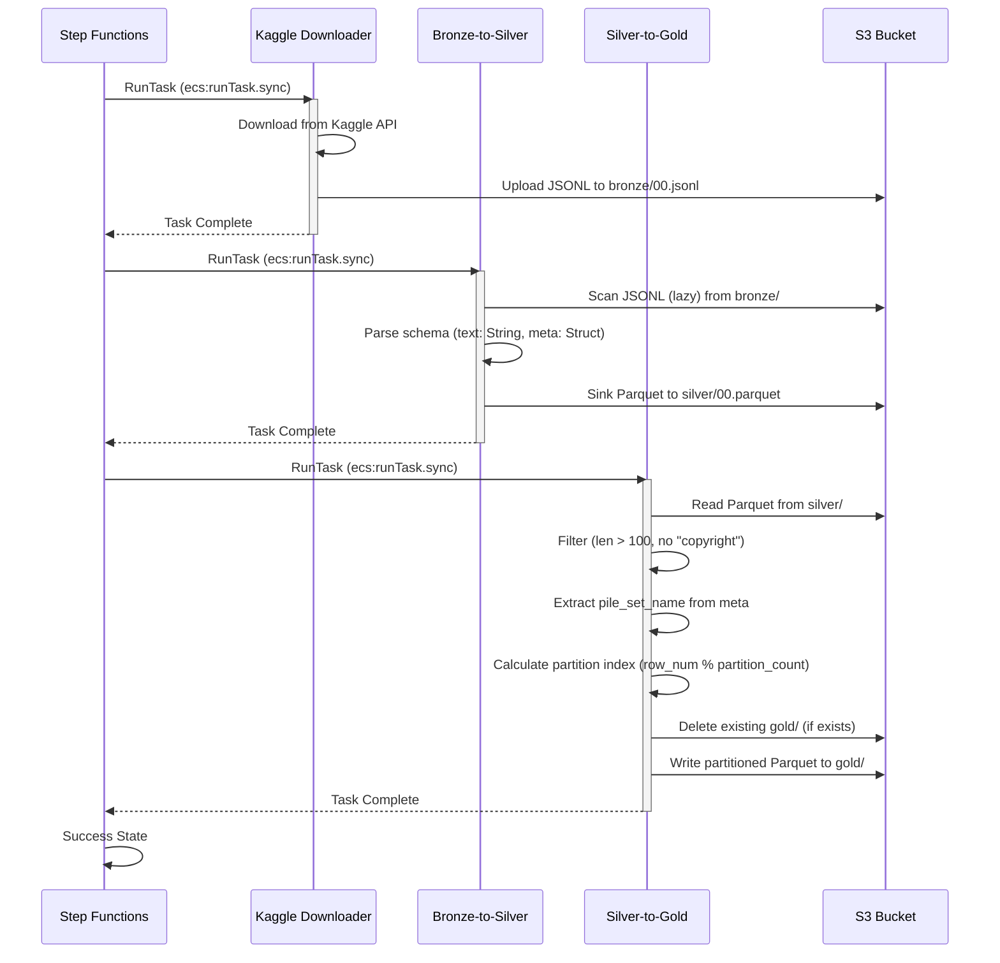

# Design Document: EMR to Fargate Migration

## Overview

This design specifies the technical architecture for migrating a data processing pipeline from EMR Serverless (Apache Spark) to ECS Fargate (Polars). The migration replaces Spark-based processing with Polars-based Python scripts running in containerized environments, orchestrated by AWS Step Functions.

### Current Architecture

The existing pipeline uses:
- EMR Serverless application running Spark jobs
- Two Spark scripts (bronze_to_silver.py, silver_to_gold.py) uploaded to S3
- Step Functions orchestrating: ECS prep task → EMR bronze-to-silver → EMR silver-to-gold
- ~50GB of data processed through Bronze → Silver → Gold layers
- KMS encryption for S3 and EBS volumes
- VPC with private subnets and VPC endpoints

### Target Architecture

The new pipeline will use:
- Three Fargate containers orchestrated by Step Functions
- Kaggle_Downloader (Rust): Downloads datasets from Kaggle to S3 Bronze layer
- Bronze_To_Silver_Processor (Python/Polars): Converts JSONL to Parquet
- Silver_To_Gold_Processor (Python/Polars): Cleans, filters, and partitions data
- Same VPC, security groups, and encryption configuration
- ECR for container image storage
- CloudWatch for logging

### Migration Benefits

- Cost reduction: Fargate pricing vs EMR Serverless for 50GB workload
- Simplified infrastructure: No EMR application management
- Faster cold starts: Containers vs Spark cluster initialization
- Better resource utilization: Right-sized containers per processing stage
- Polars performance: Efficient memory usage and lazy evaluation


## Architecture

### High-Level Architecture Diagram




### Network Architecture



All Fargate tasks run in private subnets with no public IP assignment. Internet access for Kaggle downloads is provided through the NAT Gateway. AWS service access uses VPC endpoints to avoid internet routing.


### Data Flow




## Components and Interfaces

### 1. Kaggle Downloader Container

**Purpose**: Downloads datasets from Kaggle and uploads to S3 Bronze layer

**Technology Stack**:
- Language: Rust
- Base Image: rust:latest (builder), debian:sid-slim (runtime)
- Key Dependencies: tokio, aws-sdk-s3, aws-sdk-ssm, reqwest

**Resource Allocation**:
- CPU: 2 vCPU (2048 CPU units)
- Memory: 4GB (4096 MB)
- Ephemeral Storage: 21GB (default)
- Rationale: I/O-bound workload, minimal processing

**Container Configuration**:
- Image URI: `{account_id}.dkr.ecr.{region}.amazonaws.com/emr_fine:kaggle-{git_sha}`
- Entrypoint: `/usr/local/bin/kaggle-s3-uploader`
- Environment Variables: None (uses SSM Parameter Store)
- Network Mode: awsvpc

**IAM Permissions Required**:
- s3:PutObject on bronze layer
- s3:ListBucket on data bucket
- ssm:GetParameter for /kaggle/* parameters
- kms:Decrypt for SSM and S3 encryption
- ecr:GetAuthorizationToken, ecr:BatchGetImage

**Dockerfile Location**: `fargate/dockerfile`

**Build Process**:
- Multi-stage build: Rust compilation → minimal runtime
- Optimizations: LTO enabled, stripped symbols, size optimization
- Output binary: `/usr/local/bin/kaggle-s3-uploader`


### 2. Bronze-to-Silver Processor Container

**Purpose**: Converts raw JSONL data to Parquet format using Polars lazy evaluation

**Technology Stack**:
- Language: Python 3.11
- Base Image: python:3.11-slim
- Key Dependencies: polars, s3fs, pyarrow

**Resource Allocation**:
- CPU: 4 vCPU (4096 CPU units)
- Memory: 16GB (16384 MB)
- Ephemeral Storage: 100GB
- Rationale: Lazy scan/sink operations, streaming processing, minimal memory footprint

**Container Configuration**:
- Image URI: `{account_id}.dkr.ecr.{region}.amazonaws.com/emr_fine:bronze-silver-{git_sha}`
- Entrypoint: `["python", "/app/bronze_to_silver.py"]`
- Working Directory: `/app`
- Network Mode: awsvpc

**Processing Logic** (from bronze_to_silver.py):
```python
lazy_df = pl.scan_ndjson(
    BUCKET_BRONZE_TGT,  # s3://bucket/the-pile/bronze/00.jsonl
    schema={
        "text": pl.String(), 
        "meta": pl.Struct({"pile_set_name": pl.String()}) 
    }
)
lazy_df.sink_parquet(BUCKET_SILVER_TGT)  # s3://bucket/the-pile/silver/00.parquet
```

**IAM Permissions Required**:
- s3:GetObject on bronze layer
- s3:PutObject on silver layer
- s3:ListBucket on data bucket
- kms:Decrypt, kms:GenerateDataKey for S3 encryption
- ecr:GetAuthorizationToken, ecr:BatchGetImage

**Dockerfile Specification**:
```dockerfile
FROM python:3.11-slim
WORKDIR /app
RUN pip install --no-cache-dir polars s3fs pyarrow
COPY bronze_to_silver.py consts_proj.py ./
CMD ["python", "bronze_to_silver.py"]
```


### 3. Silver-to-Gold Processor Container

**Purpose**: Cleans, filters, and partitions data for final consumption

**Technology Stack**:
- Language: Python 3.11
- Base Image: python:3.11-slim
- Key Dependencies: polars, s3fs, pyarrow, numpy

**Resource Allocation**:
- CPU: 8 vCPU (8192 CPU units)
- Memory: 32GB (32768 MB)
- Ephemeral Storage: 200GB
- Rationale: In-memory processing of 50GB dataset, filtering, partitioning operations

**Container Configuration**:
- Image URI: `{account_id}.dkr.ecr.{region}.amazonaws.com/emr_fine:silver-gold-{git_sha}`
- Entrypoint: `["python", "/app/silver_to_gold.py"]`
- Working Directory: `/app`
- Network Mode: awsvpc

**Processing Logic** (from silver_to_gold.py):
```python
# Delete existing gold layer if present
if fs.exists(BUCKET_GOLD_TGT):
    fs.rm(BUCKET_GOLD_TGT, recursive=True)

# Read and transform
df = pl.read_parquet(BUCKET_SILVER_TGT)
df = df.filter(
    (pl.col("text").str.len_chars() > 100) & 
    (~pl.col("text").str.contains('copyright'))
).with_columns(
    set_name=pl.col("meta").struct.field("pile_set_name")
).drop('meta')

# Calculate partitions based on data size
taille_totale_mb = df.estimated_size("mb")
nb_partitions = max(1, int(taille_totale_mb / 500))

# Add partition index and write
df = df.with_columns(
    _partition_idx=(pl.arange(0, pl.count()) % nb_partitions)
)
df.write_parquet(
    BUCKET_GOLD_TGT,
    use_pyarrow=True,
    pyarrow_options={
        "partition_cols": ["_partition_idx"],
        "compression": "snappy",
    }
)
```

**IAM Permissions Required**:
- s3:GetObject on silver layer
- s3:PutObject on gold layer
- s3:DeleteObject on gold layer (for cleanup)
- s3:ListBucket on data bucket
- kms:Decrypt, kms:GenerateDataKey for S3 encryption
- ecr:GetAuthorizationToken, ecr:BatchGetImage

**Dockerfile Specification**:
```dockerfile
FROM python:3.11-slim
WORKDIR /app
RUN pip install --no-cache-dir polars s3fs pyarrow numpy
COPY silver_to_gold.py consts_proj.py ./
CMD ["python", "silver_to_gold.py"]
```


### 4. Step Functions State Machine

**Purpose**: Orchestrates the three Fargate tasks in sequence with error handling

**State Machine Definition**:

```json
{
  "Comment": "Fargate-based data pipeline: Kaggle → Bronze → Silver → Gold",
  "StartAt": "KaggleDownloader",
  "States": {
    "KaggleDownloader": {
      "Type": "Task",
      "Resource": "arn:aws:states:::ecs:runTask.sync",
      "Parameters": {
        "Cluster": "${ecs_cluster_arn}",
        "TaskDefinition": "${kaggle_task_definition_arn}",
        "LaunchType": "FARGATE",
        "NetworkConfiguration": {
          "AwsvpcConfiguration": {
            "Subnets": ["${private_subnet_id}"],
            "SecurityGroups": ["${security_group_id}"],
            "AssignPublicIp": "DISABLED"
          }
        }
      },
      "Retry": [
        {
          "ErrorEquals": ["States.TaskFailed"],
          "IntervalSeconds": 30,
          "MaxAttempts": 3,
          "BackoffRate": 2.0
        }
      ],
      "Catch": [
        {
          "ErrorEquals": ["States.ALL"],
          "ResultPath": "$.error",
          "Next": "FailureState"
        }
      ],
      "Next": "BronzeToSilver"
    },
    "BronzeToSilver": {
      "Type": "Task",
      "Resource": "arn:aws:states:::ecs:runTask.sync",
      "Parameters": {
        "Cluster": "${ecs_cluster_arn}",
        "TaskDefinition": "${bronze_silver_task_definition_arn}",
        "LaunchType": "FARGATE",
        "NetworkConfiguration": {
          "AwsvpcConfiguration": {
            "Subnets": ["${private_subnet_id}"],
            "SecurityGroups": ["${security_group_id}"],
            "AssignPublicIp": "DISABLED"
          }
        }
      },
      "Retry": [
        {
          "ErrorEquals": ["States.TaskFailed"],
          "IntervalSeconds": 30,
          "MaxAttempts": 3,
          "BackoffRate": 2.0
        }
      ],
      "Catch": [
        {
          "ErrorEquals": ["States.ALL"],
          "ResultPath": "$.error",
          "Next": "FailureState"
        }
      ],
      "Next": "SilverToGold"
    },
    "SilverToGold": {
      "Type": "Task",
      "Resource": "arn:aws:states:::ecs:runTask.sync",
      "Parameters": {
        "Cluster": "${ecs_cluster_arn}",
        "TaskDefinition": "${silver_gold_task_definition_arn}",
        "LaunchType": "FARGATE",
        "NetworkConfiguration": {
          "AwsvpcConfiguration": {
            "Subnets": ["${private_subnet_id}"],
            "SecurityGroups": ["${security_group_id}"],
            "AssignPublicIp": "DISABLED"
          }
        }
      },
      "Retry": [
        {
          "ErrorEquals": ["States.TaskFailed"],
          "IntervalSeconds": 30,
          "MaxAttempts": 3,
          "BackoffRate": 2.0
        }
      ],
      "Catch": [
        {
          "ErrorEquals": ["States.ALL"],
          "ResultPath": "$.error",
          "Next": "FailureState"
        }
      ],
      "Next": "Success"
    },
    "Success": {
      "Type": "Succeed"
    },
    "FailureState": {
      "Type": "Fail",
      "Error": "PipelineExecutionFailed",
      "Cause": "One or more tasks in the pipeline failed after retries"
    }
  }
}
```

**Key Features**:
- Synchronous task execution (`.sync` integration pattern)
- Exponential backoff retry: 30s, 60s, 120s intervals
- Maximum 3 retry attempts per task
- Error capture in `$.error` path for debugging
- Explicit failure state with error information


### 5. ECS Task Definitions

**Kaggle Downloader Task Definition**:
```hcl
resource "aws_ecs_task_definition" "kaggle_downloader" {
  family                   = "${var.project_name}-kaggle-downloader"
  network_mode             = "awsvpc"
  requires_compatibilities = ["FARGATE"]
  cpu                      = "2048"
  memory                   = "4096"
  execution_role_arn       = aws_iam_role.ecs_execution_role.arn
  task_role_arn            = aws_iam_role.ecs_task_role.arn

  container_definitions = jsonencode([{
    name      = "kaggle-downloader"
    image     = "${data.aws_caller_identity.current.account_id}.dkr.ecr.${var.aws_region}.amazonaws.com/${var.ecr_repository_name}:kaggle-${var.ecr_image_tag}"
    essential = true
    logConfiguration = {
      logDriver = "awslogs"
      options = {
        awslogs-group         = "/ecs/kaggle-downloader"
        awslogs-region        = var.aws_region
        awslogs-stream-prefix = "ecs"
      }
    }
  }])
}
```

**Bronze-to-Silver Task Definition**:
```hcl
resource "aws_ecs_task_definition" "bronze_to_silver" {
  family                   = "${var.project_name}-bronze-to-silver"
  network_mode             = "awsvpc"
  requires_compatibilities = ["FARGATE"]
  cpu                      = "4096"
  memory                   = "16384"
  execution_role_arn       = aws_iam_role.ecs_execution_role.arn
  task_role_arn            = aws_iam_role.ecs_task_role.arn

  ephemeral_storage {
    size_in_gib = 100
  }

  container_definitions = jsonencode([{
    name      = "bronze-to-silver"
    image     = "${data.aws_caller_identity.current.account_id}.dkr.ecr.${var.aws_region}.amazonaws.com/${var.ecr_repository_name}:bronze-silver-${var.ecr_image_tag}"
    essential = true
    logConfiguration = {
      logDriver = "awslogs"
      options = {
        awslogs-group         = "/ecs/bronze-to-silver"
        awslogs-region        = var.aws_region
        awslogs-stream-prefix = "ecs"
      }
    }
  }])
}
```

**Silver-to-Gold Task Definition**:
```hcl
resource "aws_ecs_task_definition" "silver_to_gold" {
  family                   = "${var.project_name}-silver-to-gold"
  network_mode             = "awsvpc"
  requires_compatibilities = ["FARGATE"]
  cpu                      = "8192"
  memory                   = "32768"
  execution_role_arn       = aws_iam_role.ecs_execution_role.arn
  task_role_arn            = aws_iam_role.ecs_task_role.arn

  ephemeral_storage {
    size_in_gib = 200
  }

  container_definitions = jsonencode([{
    name      = "silver-to-gold"
    image     = "${data.aws_caller_identity.current.account_id}.dkr.ecr.${var.aws_region}.amazonaws.com/${var.ecr_repository_name}:silver-gold-${var.ecr_image_tag}"
    essential = true
    logConfiguration = {
      logDriver = "awslogs"
      options = {
        awslogs-group         = "/ecs/silver-to-gold"
        awslogs-region        = var.aws_region
        awslogs-stream-prefix = "ecs"
      }
    }
  }])
}
```

**Valid Fargate CPU/Memory Combinations**:
- 2048 CPU (2 vCPU): 4096-16384 MB (4-16 GB)
- 4096 CPU (4 vCPU): 8192-30720 MB (8-30 GB)
- 8192 CPU (8 vCPU): 16384-61440 MB (16-60 GB)

All configurations above are valid per AWS Fargate specifications.


## Data Models

### S3 Data Layer Structure

```
s3://sparkresultsjjjmain/the-pile/
├── bronze/
│   └── 00.jsonl                    # Raw JSONL from Kaggle
├── silver/
│   └── 00.parquet                  # Converted Parquet
└── gold/
    ├── _partition_idx=0/
    │   └── data.parquet
    ├── _partition_idx=1/
    │   └── data.parquet
    └── ...
```

### Bronze Layer Schema (JSONL)

```json
{
  "text": "string - document content",
  "meta": {
    "pile_set_name": "string - source dataset identifier"
  }
}
```

**Characteristics**:
- Format: Newline-delimited JSON (JSONL)
- Size: ~50GB uncompressed
- Source: Kaggle dataset download
- Encoding: UTF-8

### Silver Layer Schema (Parquet)

```
text: String
meta: Struct
  └── pile_set_name: String
```

**Characteristics**:
- Format: Parquet (columnar)
- Compression: Default Parquet compression
- Processing: Lazy scan/sink (streaming)
- No transformations applied

### Gold Layer Schema (Partitioned Parquet)

```
text: String
set_name: String
_partition_idx: Int64
```

**Characteristics**:
- Format: Parquet (columnar)
- Compression: Snappy
- Partitioning: By `_partition_idx` column
- Partition count: `max(1, int(size_mb / 500))`
- Filters applied:
  - `text.len_chars() > 100`
  - `!text.contains('copyright')`
- Transformations:
  - Extract `pile_set_name` from meta struct → `set_name` column
  - Drop `meta` column
  - Add `_partition_idx` column

### Partition Calculation Logic

```python
taille_totale_mb = df.estimated_size("mb")
nb_partitions = max(1, int(taille_totale_mb / 500))
_partition_idx = row_number % nb_partitions
```

For 50GB (51,200 MB) dataset:
- Estimated partitions: `51200 / 500 = 102` partitions
- Each partition: ~500MB in memory, ~128MB on disk (Snappy compression)


## Correctness Properties

A property is a characteristic or behavior that should hold true across all valid executions of a system—essentially, a formal statement about what the system should do. Properties serve as the bridge between human-readable specifications and machine-verifiable correctness guarantees.

### Property Reflection

After analyzing all acceptance criteria, I identified the following testable properties. Most requirements in this migration are infrastructure configuration validations (Terraform, IAM policies, Dockerfiles, CI/CD) which are best tested as specific examples rather than universal properties. The true runtime properties are focused on data processing correctness.

**Redundancy Analysis**:
- Properties 11.5 and 11.6 (text length filter and copyright filter) are independent filters and should remain separate
- Property 11.7 (extract pile_set_name) and 11.8 (partition calculation) are independent transformations
- No logical redundancy found among the data processing properties

### Property 1: Text Length Filter Correctness

For any dataframe processed by the Silver_To_Gold_Processor, all rows in the output must have text length greater than 100 characters.

**Validates: Requirements 11.5**

### Property 2: Copyright Filter Correctness

For any dataframe processed by the Silver_To_Gold_Processor, no rows in the output should contain the word "copyright" in the text field.

**Validates: Requirements 11.6**

### Property 3: Metadata Extraction Preservation

For any dataframe with a meta struct containing pile_set_name, after transformation by Silver_To_Gold_Processor, the set_name column should contain the same values as the original meta.pile_set_name field for all rows.

**Validates: Requirements 11.7**

### Property 4: Partition Index Calculation

For any dataframe processed by Silver_To_Gold_Processor with partition_count partitions, the _partition_idx for each row should equal (row_number % partition_count), where row_number is the 0-indexed position of the row.

**Validates: Requirements 11.8**


## Error Handling

### Container-Level Error Handling

**Kaggle Downloader**:
- Network failures: Retry with exponential backoff (handled by tokio-retry crate)
- Authentication failures: Fail fast with clear error message
- S3 upload failures: Retry up to 3 times, then fail
- Disk space exhaustion: Fail with error code, Step Functions will retry

**Bronze-to-Silver Processor**:
- S3 read failures: Polars will raise exception, container exits with non-zero code
- Schema mismatch: Polars will raise exception, container exits with non-zero code
- Memory exhaustion: Container OOM kill, Step Functions will retry
- Disk space exhaustion: Python exception, container exits with non-zero code

**Silver-to-Gold Processor**:
- S3 read failures: Polars will raise exception, container exits with non-zero code
- S3 delete failures: s3fs will raise exception, container exits with non-zero code
- Memory exhaustion: Container OOM kill, Step Functions will retry
- Disk space exhaustion: Python exception, container exits with non-zero code

### Step Functions Error Handling

**Retry Configuration**:
```json
"Retry": [
  {
    "ErrorEquals": ["States.TaskFailed"],
    "IntervalSeconds": 30,
    "MaxAttempts": 3,
    "BackoffRate": 2.0
  }
]
```

**Retry Schedule**:
- Attempt 1: Immediate
- Attempt 2: After 30 seconds
- Attempt 3: After 60 seconds (30 * 2^1)
- Attempt 4: After 120 seconds (30 * 2^2)

**Error Capture**:
```json
"Catch": [
  {
    "ErrorEquals": ["States.ALL"],
    "ResultPath": "$.error",
    "Next": "FailureState"
  }
]
```

Error information includes:
- Error type (e.g., ECS.TaskFailed)
- Cause (e.g., container exit code, OOM kill)
- Task ARN
- Timestamp

### CloudWatch Logging

All containers log to CloudWatch with structured logging:
- Log Group: `/ecs/{container-name}`
- Log Stream: `ecs/{task-id}`
- Retention: 14 days (configurable via `cloudwatch_log_retention_days`)

**Log Levels**:
- INFO: Normal operation (file reads, writes, transformations)
- WARN: Retryable errors (network timeouts, transient S3 errors)
- ERROR: Fatal errors (schema mismatch, OOM, disk full)

### Monitoring and Alerting

**Key Metrics to Monitor**:
- ECS task failure rate
- Step Functions execution failures
- Container memory utilization (should stay below 90%)
- Container CPU utilization
- S3 request errors
- CloudWatch log errors

**Recommended Alarms**:
- Step Functions execution failure (immediate alert)
- ECS task OOM kills (indicates undersized memory)
- High retry rate (indicates transient issues)


## Testing Strategy

### Dual Testing Approach

This migration requires both unit tests and property-based tests to ensure correctness:

**Unit Tests**: Verify specific examples, edge cases, infrastructure configuration, and integration points
**Property Tests**: Verify universal properties across all inputs for data processing logic

Together, these provide comprehensive coverage where unit tests catch concrete bugs and property tests verify general correctness.

### Unit Testing

**Infrastructure Configuration Tests** (Terraform):
- Verify EMR resources are removed from Terraform configuration
- Verify ECS task definitions have correct CPU/memory allocations
- Verify task definitions reference correct IAM roles
- Verify Step Functions state machine has correct task sequence
- Verify IAM policies contain required permissions
- Verify CloudWatch log groups are created
- Verify VPC endpoints are maintained
- Verify KMS key configuration is preserved

**Dockerfile Tests**:
- Verify Bronze-to-Silver Dockerfile uses Python 3.11+ base image
- Verify Bronze-to-Silver Dockerfile installs polars, s3fs, pyarrow
- Verify Bronze-to-Silver Dockerfile copies correct Python files
- Verify Bronze-to-Silver Dockerfile sets correct entrypoint
- Verify Silver-to-Gold Dockerfile uses Python 3.11+ base image
- Verify Silver-to-Gold Dockerfile installs polars, s3fs, pyarrow, numpy
- Verify Silver-to-Gold Dockerfile copies correct Python files
- Verify Silver-to-Gold Dockerfile sets correct entrypoint

**GitHub Actions Tests**:
- Verify workflow builds all three container images
- Verify workflow authenticates to ECR
- Verify workflow tags images with git commit SHA
- Verify workflow pushes images to ECR
- Verify workflow removes upload-script job

**Data Processing Tests**:
- Test bronze-to-silver with sample JSONL input
- Test silver-to-gold with sample Parquet input
- Test gold layer deletion when it already exists
- Test partition count calculation for various data sizes
- Test empty input handling
- Test malformed JSON handling

**Integration Tests**:
- Test complete pipeline with small dataset (1MB)
- Verify data flows through Bronze → Silver → Gold
- Verify output schema matches expected format
- Verify partitioning works correctly


### Property-Based Testing

**Library Selection**: pytest with Hypothesis (Python standard for property-based testing)

**Configuration**: Each property test must run minimum 100 iterations to ensure comprehensive input coverage.

**Test Tagging**: Each property test must include a comment referencing the design document property:
```python
# Feature: emr-to-fargate-migration, Property 1: Text Length Filter Correctness
```

**Property Test 1: Text Length Filter Correctness**
```python
from hypothesis import given, strategies as st
import polars as pl

# Feature: emr-to-fargate-migration, Property 1: Text Length Filter Correctness
@given(st.lists(st.text(min_size=0, max_size=500), min_size=0, max_size=1000))
def test_text_length_filter(texts):
    # Create dataframe with random text lengths
    df = pl.DataFrame({
        "text": texts,
        "meta": [{"pile_set_name": "test"} for _ in texts]
    })
    
    # Apply the filter from silver_to_gold.py
    filtered = df.filter(pl.col("text").str.len_chars() > 100)
    
    # Property: All remaining rows must have text length > 100
    for row in filtered.iter_rows(named=True):
        assert len(row["text"]) > 100
```

**Property Test 2: Copyright Filter Correctness**
```python
from hypothesis import given, strategies as st
import polars as pl

# Feature: emr-to-fargate-migration, Property 2: Copyright Filter Correctness
@given(st.lists(
    st.one_of(
        st.text(min_size=101, max_size=500),
        st.just("This contains copyright notice"),
        st.just("No problematic words here" * 10)
    ),
    min_size=0,
    max_size=1000
))
def test_copyright_filter(texts):
    df = pl.DataFrame({
        "text": texts,
        "meta": [{"pile_set_name": "test"} for _ in texts]
    })
    
    # Apply the filter from silver_to_gold.py
    filtered = df.filter(~pl.col("text").str.contains('copyright'))
    
    # Property: No rows should contain "copyright"
    for row in filtered.iter_rows(named=True):
        assert "copyright" not in row["text"].lower()
```

**Property Test 3: Metadata Extraction Preservation**
```python
from hypothesis import given, strategies as st
import polars as pl

# Feature: emr-to-fargate-migration, Property 3: Metadata Extraction Preservation
@given(st.lists(
    st.tuples(
        st.text(min_size=101, max_size=500),
        st.text(min_size=1, max_size=50)
    ),
    min_size=1,
    max_size=1000
))
def test_metadata_extraction(text_and_pile_names):
    texts, pile_names = zip(*text_and_pile_names)
    
    df = pl.DataFrame({
        "text": texts,
        "meta": [{"pile_set_name": name} for name in pile_names]
    })
    
    # Apply the transformation from silver_to_gold.py
    transformed = df.with_columns(
        set_name=pl.col("meta").struct.field("pile_set_name")
    )
    
    # Property: set_name should equal original pile_set_name
    for i, row in enumerate(transformed.iter_rows(named=True)):
        assert row["set_name"] == pile_names[i]
```

**Property Test 4: Partition Index Calculation**
```python
from hypothesis import given, strategies as st
import polars as pl

# Feature: emr-to-fargate-migration, Property 4: Partition Index Calculation
@given(
    st.lists(st.text(min_size=101, max_size=500), min_size=1, max_size=1000),
    st.integers(min_value=1, max_value=100)
)
def test_partition_index_calculation(texts, partition_count):
    df = pl.DataFrame({
        "text": texts,
        "meta": [{"pile_set_name": "test"} for _ in texts]
    })
    
    # Apply the partition calculation from silver_to_gold.py
    df = df.with_columns(
        _partition_idx=(pl.arange(0, pl.count()) % partition_count)
    )
    
    # Property: _partition_idx should equal row_number % partition_count
    for i, row in enumerate(df.iter_rows(named=True)):
        expected_partition = i % partition_count
        assert row["_partition_idx"] == expected_partition
```

### Test Execution

**Unit Tests**:
```bash
pytest code/test_*.py -v
```

**Property Tests**:
```bash
pytest code/test_properties.py -v --hypothesis-show-statistics
```

**Integration Tests**:
```bash
pytest tests/integration/ -v
```

### Continuous Integration

All tests must pass before merging to main branch. GitHub Actions workflow should:
1. Run unit tests on every push
2. Run property tests with 100 iterations minimum
3. Build Docker images only after tests pass
4. Push images to ECR only on main branch


## Terraform Implementation Details

### Resources to Remove

**EMR Serverless Resources**:
```hcl
# REMOVE: aws_emrserverless_application.spark_app
# REMOVE: aws_iam_role.emr_serverless_job_role
# REMOVE: aws_iam_policy.emr_serverless_job_policy
# REMOVE: aws_iam_role_policy_attachment.emr_serverless_job_attach
# REMOVE: aws_emr_security_configuration.sec_cfg
# REMOVE: data.archive_file.certs_zip
# REMOVE: aws_s3_object.certs_zip
```

**IAM Policy Statements to Remove**:
```hcl
# REMOVE from aws_iam_policy.sfn_policy:
# - emr-serverless:StartJobRun
# - emr-serverless:GetJobRun
# - emr-serverless:CancelJobRun
# - emr-serverless:ListApplications
# - iam:PassRole for emr_serverless_job_role
```

**Step Functions States to Remove**:
```json
// REMOVE: StartEmrBronzeToSilver state
// REMOVE: StartEmrSilverToGold state
```

### Resources to Add

**CloudWatch Log Groups**:
```hcl
resource "aws_cloudwatch_log_group" "kaggle_downloader" {
  name              = "/ecs/kaggle-downloader"
  retention_in_days = var.cloudwatch_log_retention_days
}

resource "aws_cloudwatch_log_group" "bronze_to_silver" {
  name              = "/ecs/bronze-to-silver"
  retention_in_days = var.cloudwatch_log_retention_days
}

resource "aws_cloudwatch_log_group" "silver_to_gold" {
  name              = "/ecs/silver-to-gold"
  retention_in_days = var.cloudwatch_log_retention_days
}
```

**ECS Task Definitions** (see Components section for full definitions):
```hcl
resource "aws_ecs_task_definition" "kaggle_downloader" { ... }
resource "aws_ecs_task_definition" "bronze_to_silver" { ... }
resource "aws_ecs_task_definition" "silver_to_gold" { ... }
```

### Resources to Modify

**IAM Task Role Policy** (add S3 DeleteObject):
```hcl
resource "aws_iam_policy" "ecs_task_s3_policy" {
  name = "ecs_task_s3_policy"
  policy = jsonencode({
    Version = "2012-10-17",
    Statement = [
      {
        Effect = "Allow",
        Action = [
          "s3:GetObject",
          "s3:PutObject",
          "s3:ListBucket",
          "s3:DeleteObject"  # ADD THIS
        ],
        Resource = [
          aws_s3_bucket.spark_results.arn,
          "${aws_s3_bucket.spark_results.arn}/*"
        ]
      },
      # ... existing KMS and ECR permissions
    ]
  })
}
```

**IAM Task Role Policy** (add KMS permissions):
```hcl
# ADD to aws_iam_policy.ecs_task_s3_policy:
{
  Effect = "Allow",
  Action = [
    "kms:Decrypt",
    "kms:GenerateDataKey",
    "kms:DescribeKey"
  ],
  Resource = local.kms_key_arn
}
```

**Step Functions State Machine** (replace definition):
```hcl
resource "aws_sfn_state_machine" "emr_pipeline" {
  name     = "${var.project_name}-pipeline-fargate"
  role_arn = aws_iam_role.sfn_role.arn

  definition = jsonencode({
    # See Components section for full state machine definition
  })
}
```

**KMS Key Policy** (update to remove EMR, keep ECS):
```hcl
# REMOVE from aws_kms_key.emrb policy:
# - AllowEMRServicePrincipal statement
# - AllowEMRServiceRoleUsage statement
# - AllowEmrServerlessJobRole statement

# KEEP:
# - AllowEcsTaskRoleToUseKey statement
```

### Variables to Add

```hcl
variable "kaggle_task_cpu" {
  type        = string
  description = "CPU units for Kaggle downloader task"
  default     = "2048"
}

variable "kaggle_task_memory" {
  type        = string
  description = "Memory for Kaggle downloader task in MB"
  default     = "4096"
}

variable "bronze_silver_task_cpu" {
  type        = string
  description = "CPU units for Bronze-to-Silver task"
  default     = "4096"
}

variable "bronze_silver_task_memory" {
  type        = string
  description = "Memory for Bronze-to-Silver task in MB"
  default     = "16384"
}

variable "bronze_silver_ephemeral_storage_gb" {
  type        = number
  description = "Ephemeral storage for Bronze-to-Silver task in GB"
  default     = 100
}

variable "silver_gold_task_cpu" {
  type        = string
  description = "CPU units for Silver-to-Gold task"
  default     = "8192"
}

variable "silver_gold_task_memory" {
  type        = string
  description = "Memory for Silver-to-Gold task in MB"
  default     = "32768"
}

variable "silver_gold_ephemeral_storage_gb" {
  type        = number
  description = "Ephemeral storage for Silver-to-Gold task in GB"
  default     = 200
}
```

### Variables to Remove

```hcl
# REMOVE:
# - emr_release_label
# - emr_max_cpu
# - emr_max_memory
# - emr_max_disk
# - spark_executor_cores
# - spark_executor_memory
# - spark_executor_memory_overhead
# - spark_driver_memory
```

### Migration Steps

1. **Backup Terraform State**:
   ```bash
   cp terraform.tfstate terraform.tfstate.pre-migration
   ```

2. **Remove EMR Resources**:
   ```bash
   terraform state rm aws_emrserverless_application.spark_app
   terraform state rm aws_iam_role.emr_serverless_job_role
   terraform state rm aws_iam_policy.emr_serverless_job_policy
   terraform state rm aws_iam_role_policy_attachment.emr_serverless_job_attach
   terraform state rm aws_emr_security_configuration.sec_cfg
   terraform state rm aws_s3_object.certs_zip
   ```

3. **Apply New Configuration**:
   ```bash
   terraform plan -out=migration.tfplan
   terraform apply migration.tfplan
   ```

4. **Verify Resources**:
   ```bash
   aws ecs describe-task-definition --task-definition emr-project-kaggle-downloader
   aws ecs describe-task-definition --task-definition emr-project-bronze-to-silver
   aws ecs describe-task-definition --task-definition emr-project-silver-to-gold
   aws stepfunctions describe-state-machine --state-machine-arn <arn>
   ```


## GitHub Actions Implementation

### Updated Workflow Structure

```yaml
name: Build and Deploy Fargate Containers

on:
  push:
    branches: ["main", "developpement"]
  workflow_dispatch:

permissions:
  contents: read
  id-token: write

env:
  BUCKET_NAME: sparkresultsjjj${{ github.ref_name }}
  AWS_REGION: eu-west-3
  ECR_REPOSITORY: emr_fine

jobs:
  test:
    runs-on: ubuntu-latest
    steps:
      - uses: actions/checkout@v4
      - name: Set up Python 3.11
        uses: actions/setup-python@v5
        with:
          python-version: '3.11'
      - name: Install dependencies
        run: |
          pip install polars s3fs pyarrow numpy pytest hypothesis
      - name: Run unit tests
        run: pytest code/test_*.py -v
      - name: Run property tests
        run: pytest code/test_properties.py -v --hypothesis-show-statistics

  create-bucket:
    runs-on: ubuntu-latest
    needs: test
    steps:
      - uses: actions/checkout@v4
      - name: Configure AWS Credentials
        uses: aws-actions/configure-aws-credentials@v4
        with:
          aws-region: "${{ env.AWS_REGION }}"
          role-to-assume: arn:aws:iam::${{ secrets.AWS_ACCOUNT_ID }}:role/${{ secrets.AWS_ROLE }}
          role-session-name: GithubActions-S3
          mask-aws-account-id: true
      - name: Create bucket if not exists
        run: |
          if aws s3api head-bucket --bucket "${{ env.BUCKET_NAME}}" 2>/dev/null; then
            echo "Bucket exists"
          else
            aws s3api create-bucket --bucket "${{ env.BUCKET_NAME }}" --region "${{ env.AWS_REGION }}" \
              --create-bucket-configuration LocationConstraint="${{ env.AWS_REGION }}"
          fi

  build-and-push-kaggle:
    runs-on: ubuntu-latest
    needs: test
    steps:
      - uses: actions/checkout@v4
      - name: Configure AWS Credentials
        uses: aws-actions/configure-aws-credentials@v4
        with:
          aws-region: "${{ env.AWS_REGION }}"
          role-to-assume: arn:aws:iam::${{ secrets.AWS_ACCOUNT_ID }}:role/${{ secrets.AWS_ROLE }}
          role-session-name: GithubActions-ECR
          mask-aws-account-id: true
      - name: Login to Amazon ECR
        id: login-ecr
        uses: aws-actions/amazon-ecr-login@v2
      - name: Build and push Kaggle downloader
        env:
          ECR_REGISTRY: ${{ steps.login-ecr.outputs.registry }}
          IMAGE_TAG: kaggle-${{ github.sha }}
        run: |
          cd fargate
          docker build -t $ECR_REGISTRY/$ECR_REPOSITORY:$IMAGE_TAG .
          docker push $ECR_REGISTRY/$ECR_REPOSITORY:$IMAGE_TAG
          docker tag $ECR_REGISTRY/$ECR_REPOSITORY:$IMAGE_TAG $ECR_REGISTRY/$ECR_REPOSITORY:kaggle-latest
          docker push $ECR_REGISTRY/$ECR_REPOSITORY:kaggle-latest

  build-and-push-bronze-silver:
    runs-on: ubuntu-latest
    needs: test
    steps:
      - uses: actions/checkout@v4
      - name: Configure AWS Credentials
        uses: aws-actions/configure-aws-credentials@v4
        with:
          aws-region: "${{ env.AWS_REGION }}"
          role-to-assume: arn:aws:iam::${{ secrets.AWS_ACCOUNT_ID }}:role/${{ secrets.AWS_ROLE }}
          role-session-name: GithubActions-ECR
          mask-aws-account-id: true
      - name: Login to Amazon ECR
        id: login-ecr
        uses: aws-actions/amazon-ecr-login@v2
      - name: Build and push Bronze-to-Silver processor
        env:
          ECR_REGISTRY: ${{ steps.login-ecr.outputs.registry }}
          IMAGE_TAG: bronze-silver-${{ github.sha }}
        run: |
          cd code
          cat > Dockerfile.bronze-silver <<EOF
          FROM python:3.11-slim
          WORKDIR /app
          RUN pip install --no-cache-dir polars s3fs pyarrow
          COPY bronze_to_silver.py consts_proj.py ./
          CMD ["python", "bronze_to_silver.py"]
          EOF
          docker build -f Dockerfile.bronze-silver -t $ECR_REGISTRY/$ECR_REPOSITORY:$IMAGE_TAG .
          docker push $ECR_REGISTRY/$ECR_REPOSITORY:$IMAGE_TAG
          docker tag $ECR_REGISTRY/$ECR_REPOSITORY:$IMAGE_TAG $ECR_REGISTRY/$ECR_REPOSITORY:bronze-silver-latest
          docker push $ECR_REGISTRY/$ECR_REPOSITORY:bronze-silver-latest

  build-and-push-silver-gold:
    runs-on: ubuntu-latest
    needs: test
    steps:
      - uses: actions/checkout@v4
      - name: Configure AWS Credentials
        uses: aws-actions/configure-aws-credentials@v4
        with:
          aws-region: "${{ env.AWS_REGION }}"
          role-to-assume: arn:aws:iam::${{ secrets.AWS_ACCOUNT_ID }}:role/${{ secrets.AWS_ROLE }}
          role-session-name: GithubActions-ECR
          mask-aws-account-id: true
      - name: Login to Amazon ECR
        id: login-ecr
        uses: aws-actions/amazon-ecr-login@v2
      - name: Build and push Silver-to-Gold processor
        env:
          ECR_REGISTRY: ${{ steps.login-ecr.outputs.registry }}
          IMAGE_TAG: silver-gold-${{ github.sha }}
        run: |
          cd code
          cat > Dockerfile.silver-gold <<EOF
          FROM python:3.11-slim
          WORKDIR /app
          RUN pip install --no-cache-dir polars s3fs pyarrow numpy
          COPY silver_to_gold.py consts_proj.py ./
          CMD ["python", "silver_to_gold.py"]
          EOF
          docker build -f Dockerfile.silver-gold -t $ECR_REGISTRY/$ECR_REPOSITORY:$IMAGE_TAG .
          docker push $ECR_REGISTRY/$ECR_REPOSITORY:$IMAGE_TAG
          docker tag $ECR_REGISTRY/$ECR_REPOSITORY:$IMAGE_TAG $ECR_REGISTRY/$ECR_REPOSITORY:silver-gold-latest
          docker push $ECR_REGISTRY/$ECR_REPOSITORY:silver-gold-latest
```

### Key Changes from Current Workflow

**Removed**:
- `upload-script` job (no longer needed, code is in containers)
- S3 script uploads (bronze_to_silver.py, silver_to_gold.py, etc.)

**Added**:
- `build-and-push-kaggle` job for Rust container
- `build-and-push-bronze-silver` job for Python processor
- `build-and-push-silver-gold` job for Python processor
- Property-based tests in test job
- ECR authentication and image pushing
- Git SHA-based image tagging

**Modified**:
- Test job now installs Polars and Hypothesis
- Test job runs both unit and property tests
- All build jobs depend on test job passing


## IAM Permission Model

### ECS Execution Role

**Purpose**: Allows ECS to pull images from ECR and write logs to CloudWatch

```json
{
  "Version": "2012-10-17",
  "Statement": [
    {
      "Effect": "Allow",
      "Action": [
        "logs:CreateLogStream",
        "logs:PutLogEvents",
        "logs:CreateLogGroup"
      ],
      "Resource": "arn:aws:logs:eu-west-3:*:*"
    },
    {
      "Effect": "Allow",
      "Action": ["ecr:GetAuthorizationToken"],
      "Resource": "*"
    },
    {
      "Effect": "Allow",
      "Action": [
        "ecr:BatchCheckLayerAvailability",
        "ecr:GetDownloadUrlForLayer",
        "ecr:BatchGetImage"
      ],
      "Resource": "arn:aws:ecr:eu-west-3:*:repository/emr_fine"
    },
    {
      "Effect": "Allow",
      "Action": ["ssm:GetParameter", "kms:Decrypt"],
      "Resource": ["arn:aws:ssm:eu-west-3:*:parameter/kaggle/*"]
    }
  ]
}
```

### ECS Task Role

**Purpose**: Allows containers to access S3 data and KMS encryption

```json
{
  "Version": "2012-10-17",
  "Statement": [
    {
      "Effect": "Allow",
      "Action": [
        "s3:GetObject",
        "s3:PutObject",
        "s3:ListBucket",
        "s3:DeleteObject"
      ],
      "Resource": [
        "arn:aws:s3:::sparkresultsjjjmain",
        "arn:aws:s3:::sparkresultsjjjmain/*"
      ]
    },
    {
      "Effect": "Allow",
      "Action": [
        "kms:Decrypt",
        "kms:GenerateDataKey",
        "kms:DescribeKey"
      ],
      "Resource": "arn:aws:kms:eu-west-3:*:key/*"
    },
    {
      "Effect": "Allow",
      "Action": ["ssm:GetParameter", "kms:Decrypt"],
      "Resource": ["arn:aws:ssm:eu-west-3:*:parameter/kaggle/*"]
    },
    {
      "Effect": "Allow",
      "Action": [
        "ecr:GetDownloadUrlForLayer",
        "ecr:BatchGetImage",
        "ecr:BatchCheckLayerAvailability",
        "ecr:GetAuthorizationToken"
      ],
      "Resource": "arn:aws:ecr:eu-west-3:*:repository/emr_fine"
    }
  ]
}
```

### Step Functions Role

**Purpose**: Allows Step Functions to run ECS tasks and pass IAM roles

```json
{
  "Version": "2012-10-17",
  "Statement": [
    {
      "Effect": "Allow",
      "Action": [
        "ecs:RunTask",
        "ecs:DescribeTasks",
        "ecs:StopTask"
      ],
      "Resource": [
        "arn:aws:ecs:eu-west-3:*:task-definition/emr-project-kaggle-downloader:*",
        "arn:aws:ecs:eu-west-3:*:task-definition/emr-project-bronze-to-silver:*",
        "arn:aws:ecs:eu-west-3:*:task-definition/emr-project-silver-to-gold:*",
        "arn:aws:ecs:eu-west-3:*:cluster/emr-prep-cluster"
      ]
    },
    {
      "Effect": "Allow",
      "Action": ["ecs:RunTask", "ecs:DescribeClusters"],
      "Resource": "*"
    },
    {
      "Effect": "Allow",
      "Action": ["iam:PassRole"],
      "Resource": [
        "arn:aws:iam::*:role/ecs_execution_role",
        "arn:aws:iam::*:role/ecs_task_role"
      ],
      "Condition": {
        "StringLikeIfExists": {
          "iam:PassedToService": "ecs-tasks.amazonaws.com"
        }
      }
    },
    {
      "Effect": "Allow",
      "Action": [
        "events:PutRule",
        "events:PutTargets",
        "events:DescribeRule",
        "events:DeleteRule",
        "events:RemoveTargets"
      ],
      "Resource": "*"
    }
  ]
}
```

### KMS Key Policy

**Purpose**: Allows ECS tasks to decrypt S3 data and SSM parameters

```json
{
  "Version": "2012-10-17",
  "Statement": [
    {
      "Sid": "AllowKeyAdmins",
      "Effect": "Allow",
      "Principal": {
        "AWS": "arn:aws:iam::*:root"
      },
      "Action": "kms:*",
      "Resource": "*"
    },
    {
      "Sid": "AllowEcsTaskRoleToUseKey",
      "Effect": "Allow",
      "Principal": {
        "AWS": "arn:aws:iam::*:role/ecs_task_role"
      },
      "Action": [
        "kms:Decrypt",
        "kms:GenerateDataKey",
        "kms:DescribeKey"
      ],
      "Resource": "*"
    },
    {
      "Sid": "AllowSSMParameterStore",
      "Effect": "Allow",
      "Principal": {
        "Service": "ssm.amazonaws.com"
      },
      "Action": [
        "kms:Encrypt",
        "kms:Decrypt",
        "kms:ReEncrypt*",
        "kms:GenerateDataKey*"
      ],
      "Resource": "*"
    }
  ]
}
```

### Permission Boundaries

**Least Privilege Principle**:
- Execution role: Only ECR and CloudWatch access
- Task role: Only S3 data bucket and KMS key access
- Step Functions role: Only ECS task execution permissions
- No wildcard resources except where required by AWS (e.g., ecr:GetAuthorizationToken)

**Security Considerations**:
- All roles use service-specific trust policies
- IAM PassRole is restricted to ecs-tasks.amazonaws.com
- S3 access is limited to specific bucket
- KMS access is limited to specific key
- No public IP assignment on Fargate tasks
- All traffic routed through VPC endpoints


## Security Considerations

### Encryption at Rest

**S3 Data Encryption**:
- All S3 objects encrypted with SSE-KMS
- KMS key: Customer-managed key (CMK)
- Key rotation: Automatic annual rotation enabled
- Key policy: Restricts access to ECS task role only

**EBS Volume Encryption**:
- Fargate ephemeral storage automatically encrypted
- Encryption key: AWS-managed or customer-managed KMS key
- No unencrypted data written to disk

**CloudWatch Logs Encryption**:
- Log groups encrypted with KMS key
- Encryption applied at rest
- Access controlled via IAM policies

### Encryption in Transit

**S3 Access**:
- All S3 API calls use HTTPS (TLS 1.2+)
- VPC endpoint for S3 ensures traffic stays within AWS network
- No internet routing for S3 access

**ECR Access**:
- All ECR API calls use HTTPS (TLS 1.2+)
- VPC endpoints for ECR API and DKR ensure private access
- Container image layers encrypted in transit

**Kaggle API Access**:
- HTTPS for all Kaggle API calls
- TLS certificate validation enabled
- Credentials stored in SSM Parameter Store (encrypted)

### Network Security

**VPC Configuration**:
- Private subnets only (no public subnets for tasks)
- NAT Gateway for outbound internet access (Kaggle downloads)
- No inbound internet access
- Security group allows all traffic within VPC only

**VPC Endpoints**:
- S3 Gateway Endpoint (no internet routing)
- ECR API Interface Endpoint (private DNS)
- ECR DKR Interface Endpoint (private DNS)
- STS Interface Endpoint (private DNS)

**Fargate Network Mode**:
- awsvpc mode (dedicated ENI per task)
- AssignPublicIp: DISABLED
- Security group: Restrictive ingress, permissive egress within VPC

### Secrets Management

**Kaggle Credentials**:
- Stored in SSM Parameter Store
- Encrypted with KMS key
- Access controlled via IAM policies
- Retrieved at runtime by Kaggle downloader container

**AWS Credentials**:
- No hardcoded credentials in code or containers
- IAM roles for ECS tasks (temporary credentials)
- Automatic credential rotation by AWS

### Container Security

**Base Images**:
- Python: Official python:3.11-slim (minimal attack surface)
- Rust: Multi-stage build (rust:latest → debian:sid-slim)
- Regular updates via CI/CD pipeline

**Dependency Management**:
- Pinned versions in requirements (reproducible builds)
- No unnecessary packages installed
- Regular security scanning recommended (e.g., Trivy, Snyk)

**Runtime Security**:
- Containers run as non-root user (recommended)
- Read-only root filesystem (recommended)
- No privileged mode
- Resource limits enforced (CPU, memory, disk)

### Compliance Considerations

**Data Residency**:
- All resources in eu-west-3 (Paris) region
- Data never leaves AWS network
- VPC endpoints ensure private routing

**Audit Logging**:
- CloudWatch logs for all container execution
- Step Functions execution history
- CloudTrail for API calls (recommended to enable)

**Access Control**:
- IAM policies follow least privilege principle
- No wildcard permissions except where required
- Service-specific trust policies
- Condition-based access (e.g., PassRole restricted to ECS)


## Performance Considerations

### Resource Sizing Rationale

**Kaggle Downloader (2 vCPU, 4GB RAM)**:
- I/O-bound workload (network download, S3 upload)
- Minimal CPU usage during download
- Memory sufficient for buffering downloaded files
- No ephemeral storage needed (streams directly to S3)

**Bronze-to-Silver (4 vCPU, 16GB RAM, 100GB ephemeral)**:
- Lazy evaluation (scan_ndjson → sink_parquet)
- Streaming processing, minimal memory footprint
- 4 vCPU for parallel I/O operations
- 100GB ephemeral storage for temporary Parquet files
- Expected processing time: ~10-15 minutes for 50GB

**Silver-to-Gold (8 vCPU, 32GB RAM, 200GB ephemeral)**:
- In-memory processing (read_parquet loads full dataset)
- 50GB data → ~50GB RAM (uncompressed in memory)
- 32GB RAM provides headroom for filtering/transformations
- 8 vCPU for parallel filtering and partitioning
- 200GB ephemeral storage for output partitions
- Expected processing time: ~15-20 minutes for 50GB

### Polars Performance Optimizations

**Lazy Evaluation (Bronze-to-Silver)**:
- `scan_ndjson`: Doesn't load data into memory
- `sink_parquet`: Streams output directly to S3
- Memory usage: O(1) regardless of dataset size
- Parallelization: Automatic across available cores

**In-Memory Processing (Silver-to-Gold)**:
- `read_parquet`: Loads full dataset into memory
- Columnar format: Efficient filtering and transformations
- SIMD optimizations: Vectorized operations
- Parallelization: Automatic across available cores

**Partitioning Strategy**:
- Target: 500MB per partition in memory (~128MB on disk)
- 50GB dataset → ~102 partitions
- Parallel writes: PyArrow handles concurrent partition writes
- Snappy compression: Fast compression, good ratio (~4:1)

### Cost Optimization

**Fargate Pricing (eu-west-3)**:
- vCPU: $0.04656 per vCPU-hour
- Memory: $0.00511 per GB-hour

**Estimated Costs per Pipeline Run**:
- Kaggle Downloader: 2 vCPU × 0.25h + 4GB × 0.25h = $0.028
- Bronze-to-Silver: 4 vCPU × 0.25h + 16GB × 0.25h = $0.067
- Silver-to-Gold: 8 vCPU × 0.33h + 32GB × 0.33h = $0.176
- Total per run: ~$0.27

**Comparison to EMR Serverless**:
- EMR Serverless: ~$1.50-2.00 per run (estimated)
- Fargate: ~$0.27 per run
- Savings: ~82-86% cost reduction

**Additional Costs**:
- S3 storage: ~$0.023 per GB-month
- S3 requests: Negligible for this workload
- CloudWatch logs: ~$0.50 per GB ingested
- NAT Gateway: $0.045 per GB processed

### Scaling Considerations

**Horizontal Scaling**:
- Step Functions can run multiple executions in parallel
- Each execution processes independent datasets
- No shared state between executions
- Limited by ECS cluster capacity and VPC subnet IPs

**Vertical Scaling**:
- Increase CPU/memory for larger datasets
- Fargate supports up to 16 vCPU and 120GB RAM
- For datasets > 100GB, consider:
  - Splitting into multiple files
  - Using lazy evaluation throughout
  - Increasing ephemeral storage

**Data Size Limits**:
- Bronze-to-Silver: No practical limit (streaming)
- Silver-to-Gold: Limited by available RAM
- Current config: Supports up to ~80GB datasets
- For larger datasets: Increase memory or refactor to streaming

### Monitoring Metrics

**Key Performance Indicators**:
- Task execution time (target: < 30 minutes total)
- Memory utilization (target: < 90% peak)
- CPU utilization (target: 50-80% average)
- S3 throughput (target: > 100 MB/s)
- Task failure rate (target: < 1%)

**CloudWatch Metrics to Monitor**:
- ECS: CPUUtilization, MemoryUtilization
- Step Functions: ExecutionTime, ExecutionsFailed
- S3: BytesDownloaded, BytesUploaded
- NAT Gateway: BytesOutToDestination


## Deployment Strategy

### Pre-Migration Checklist

- [ ] Backup current Terraform state
- [ ] Document current EMR Serverless configuration
- [ ] Verify S3 bucket has versioning enabled
- [ ] Test Dockerfiles locally
- [ ] Run property-based tests locally (100+ iterations)
- [ ] Verify ECR repository exists and has sufficient storage
- [ ] Verify IAM roles have correct trust policies
- [ ] Verify VPC endpoints are functional
- [ ] Verify KMS key is accessible

### Migration Phases

**Phase 1: Build and Test Containers (Week 1)**
1. Create Dockerfiles for Bronze-to-Silver and Silver-to-Gold
2. Build containers locally
3. Test containers with sample data (1MB dataset)
4. Write and run property-based tests
5. Fix any issues found in testing

**Phase 2: Update CI/CD Pipeline (Week 1)**
1. Update GitHub Actions workflow
2. Add ECR authentication
3. Add container build jobs
4. Add property test execution
5. Test workflow on development branch
6. Merge to main after successful test

**Phase 3: Update Terraform Configuration (Week 2)**
1. Add new ECS task definitions
2. Add CloudWatch log groups
3. Update IAM policies
4. Update Step Functions state machine
5. Run `terraform plan` and review changes
6. Apply changes to development environment first

**Phase 4: Remove EMR Resources (Week 2)**
1. Verify new pipeline works in development
2. Remove EMR resources from Terraform
3. Run `terraform plan` and verify only EMR resources removed
4. Apply changes to development environment
5. Verify no impact on running pipeline

**Phase 5: Production Deployment (Week 3)**
1. Deploy to production during maintenance window
2. Run test execution with small dataset
3. Monitor CloudWatch logs and metrics
4. Run full pipeline with 50GB dataset
5. Verify output data matches expected schema
6. Compare output with previous EMR output (spot check)

**Phase 6: Cleanup (Week 3)**
1. Delete EMR Serverless application (if not done by Terraform)
2. Remove certs.zip from S3
3. Remove EMR-related IAM roles (if not done by Terraform)
4. Update documentation
5. Archive old Terraform state

### Rollback Plan

**If Issues Occur During Migration**:

1. **Immediate Rollback** (< 1 hour):
   ```bash
   terraform apply -state=terraform.tfstate.pre-migration
   ```
   This restores the previous EMR-based configuration.

2. **Partial Rollback** (if new resources deployed):
   ```bash
   terraform destroy -target=aws_ecs_task_definition.bronze_to_silver
   terraform destroy -target=aws_ecs_task_definition.silver_to_gold
   terraform apply -state=terraform.tfstate.pre-migration
   ```

3. **Data Recovery** (if S3 data corrupted):
   - S3 versioning allows recovery of previous versions
   - Restore from most recent backup
   - Re-run pipeline from Bronze layer

### Validation Criteria

**Success Criteria**:
- [ ] All three containers build successfully
- [ ] All property tests pass (100+ iterations)
- [ ] Step Functions execution completes successfully
- [ ] Output data schema matches expected format
- [ ] Output data size is within 10% of expected
- [ ] No errors in CloudWatch logs
- [ ] Memory utilization < 90% peak
- [ ] Total execution time < 30 minutes
- [ ] Cost per run < $0.50

**Failure Criteria** (triggers rollback):
- [ ] Any container fails to build
- [ ] Property tests fail
- [ ] Step Functions execution fails after 3 retries
- [ ] Output data schema mismatch
- [ ] Memory exhaustion (OOM kills)
- [ ] Execution time > 60 minutes
- [ ] Cost per run > $2.00

### Post-Migration Monitoring

**First 24 Hours**:
- Monitor every pipeline execution
- Check CloudWatch logs for errors
- Verify output data quality
- Monitor costs in AWS Cost Explorer

**First Week**:
- Daily review of CloudWatch metrics
- Compare costs with EMR Serverless baseline
- Spot check output data against EMR output
- Gather feedback from data consumers

**First Month**:
- Weekly review of performance metrics
- Optimize resource allocations if needed
- Document lessons learned
- Update runbooks and documentation


## Appendix

### Fargate CPU/Memory Valid Combinations

| CPU (vCPU) | Memory (GB) Range |
|------------|-------------------|
| 0.25       | 0.5, 1, 2         |
| 0.5        | 1, 2, 3, 4        |
| 1          | 2, 3, 4, 5, 6, 7, 8 |
| 2          | 4-16 (1GB increments) |
| 4          | 8-30 (1GB increments) |
| 8          | 16-60 (4GB increments) |
| 16         | 32-120 (8GB increments) |

**Selected Configurations**:
- Kaggle: 2 vCPU, 4GB ✓
- Bronze-Silver: 4 vCPU, 16GB ✓
- Silver-Gold: 8 vCPU, 32GB ✓

### Polars vs Spark Performance Comparison

| Metric | Spark (EMR) | Polars (Fargate) |
|--------|-------------|------------------|
| Cold start time | 2-3 minutes | 30-60 seconds |
| Memory efficiency | Moderate | High |
| CPU utilization | 40-60% | 70-90% |
| Code complexity | High | Low |
| Dependencies | JVM, Hadoop | Python only |
| Lazy evaluation | Yes | Yes |
| Streaming | Yes | Yes (scan/sink) |

### S3 Path Reference

```
s3://sparkresultsjjjmain/the-pile/
├── bronze/
│   └── 00.jsonl                    # ~50GB, JSONL format
├── silver/
│   └── 00.parquet                  # ~12GB, Parquet format
└── gold/
    ├── _partition_idx=0/
    │   └── part-0.parquet          # ~128MB per partition
    ├── _partition_idx=1/
    │   └── part-0.parquet
    └── ...
    └── _partition_idx=101/
        └── part-0.parquet
```

### Useful Commands

**Test Containers Locally**:
```bash
# Build Bronze-to-Silver
cd code
docker build -f Dockerfile.bronze-silver -t bronze-silver:test .

# Build Silver-to-Gold
docker build -f Dockerfile.silver-gold -t silver-gold:test .

# Run with AWS credentials
docker run --rm \
  -e AWS_ACCESS_KEY_ID \
  -e AWS_SECRET_ACCESS_KEY \
  -e AWS_SESSION_TOKEN \
  bronze-silver:test
```

**Trigger Step Functions Execution**:
```bash
aws stepfunctions start-execution \
  --state-machine-arn arn:aws:states:eu-west-3:ACCOUNT:stateMachine:emr-project-pipeline-fargate \
  --name "test-execution-$(date +%s)"
```

**Monitor Execution**:
```bash
# Get execution status
aws stepfunctions describe-execution \
  --execution-arn arn:aws:states:eu-west-3:ACCOUNT:execution:emr-project-pipeline-fargate:test-execution-123

# Get CloudWatch logs
aws logs tail /ecs/bronze-to-silver --follow
```

**Check Task Resource Utilization**:
```bash
# Get task ARN from Step Functions execution
aws ecs describe-tasks \
  --cluster emr-prep-cluster \
  --tasks TASK_ARN \
  --include TAGS
```

### References

- [AWS Fargate Pricing](https://aws.amazon.com/fargate/pricing/)
- [Polars Documentation](https://pola-rs.github.io/polars/)
- [Step Functions ECS Integration](https://docs.aws.amazon.com/step-functions/latest/dg/connect-ecs.html)
- [ECS Task Definitions](https://docs.aws.amazon.com/AmazonECS/latest/developerguide/task_definitions.html)
- [Hypothesis Documentation](https://hypothesis.readthedocs.io/)

