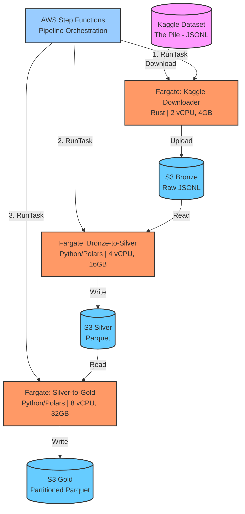

# BigData Pipeline: Fargate + Polars + Rust

Ce projet illustre le déploiement de bout en bout d'un pipeline Big Data moderne sur AWS. Il intègre le téléchargement de données volumineuses (~50GB) via AWS Fargate (Rust), leur stockage sur Amazon S3, et leur traitement avec Polars (Python) dans des conteneurs Fargate orchestrés par AWS Step Functions. L'infrastructure complète est provisionnée automatiquement par Terraform.

## Sommaire
1. [Architecture](#architecture)
2. [Prérequis](#prérequis)
3. [Structure du Projet](#structure-du-projet)
4. [Installation & Déploiement](#installation--déploiement)
5. [Usage](#usage)
6. [Tests](#tests)
7. [Licence](#licence)
8. [Contact](#contact)

## Architecture

Le pipeline de données est organisé en trois étapes (Architecture Medallion) orchestrées par AWS Step Functions :



### Pipeline de traitement

1. **Kaggle Downloader (Rust/Fargate)** : Télécharge ~50GB de données depuis Kaggle et les upload sur S3 Bronze (JSONL)
2. **Bronze-to-Silver (Polars/Fargate)** : Conversion JSONL → Parquet avec lazy evaluation
3. **Silver-to-Gold (Polars/Fargate)** : Nettoyage, filtrage (longueur texte > 100, pas de copyright), partitionnement

### Technologies clés

- **Rust** : Téléchargement haute performance avec gestion asynchrone (tokio)
- **Polars** : Traitement de données ultra-rapide avec lazy evaluation
- **Fargate** : Conteneurs serverless avec ressources adaptées par étape
- **Step Functions** : Orchestration avec retry automatique et gestion d'erreurs
- **Terraform** : Infrastructure as Code complète

## Prérequis

### Outils requis
- **AWS CLI** installé et configuré
- **Terraform** v1.5+
- **Docker** (pour construire les images)
- **Python** 3.11+ (pour les tests locaux)
- **Rust** 1.70+ (optionnel, pour modifier le downloader)

### Configuration AWS
- Credentials AWS configurés (ID et Rôle)
- Clé d'API Kaggle stockée dans AWS Systems Manager :
  - `/kaggle/username` : Votre nom d'utilisateur Kaggle
  - `/kaggle/key` : Votre clé API Kaggle
- Repository ECR créé (ou sera créé automatiquement)

### Secrets GitHub (pour CI/CD)
- `AWS_ACCOUNT_ID` : Votre ID de compte AWS
- `AWS_ROLE` : Nom du rôle IAM pour GitHub Actions

## Configuration Terraform

Le projet utilise des fichiers de variables pour faciliter la personnalisation:

- `terraform/variables.tf`: Définitions des variables avec valeurs par défaut
- `terraform/terraform.tfvars`: Vos valeurs de configuration (à créer depuis l'exemple)
- `terraform/terraform.tfvars.example`: Template de configuration
- `terraform/CONFIG.md`: Documentation complète de configuration
- `terraform/KMS_MANAGEMENT.md`: Guide de gestion de la clé KMS
- `terraform/DESTROY_TROUBLESHOOTING.md`: Guide de dépannage pour la destruction

### Fichiers de configuration importants

```bash
terraform/
├── main.tf                          # Infrastructure principale
├── kms.tf                           # Gestion de la clé KMS
├── variables.tf                     # Définitions des variables
├── terraform.tfvars                 # VOS valeurs (à créer)
├── terraform.tfvars.example         # Template
├── CONFIG.md                        # Documentation configuration
├── KMS_MANAGEMENT.md                # Guide KMS
└── DESTROY_TROUBLESHOOTING.md       # Guide dépannage
```

## Structure du Projet

```
.
├── code/                           # Processeurs Python/Polars
│   ├── bronze_to_silver.py        # Conversion JSONL → Parquet
│   ├── silver_to_gold.py          # Nettoyage et partitionnement
│   ├── consts_proj.py             # Configuration S3
│   ├── Dockerfile.bronze-silver   # Image Bronze-to-Silver
│   ├── Dockerfile.silver-gold     # Image Silver-to-Gold
│   ├── test_clean_df.py           # Tests unitaires
│   └── test_properties.py         # Tests property-based (Hypothesis)
│
├── fargate/                        # Kaggle Downloader (Rust)
│   ├── src/
│   │   ├── main.rs                # Point d'entrée
│   │   ├── kaggle.rs              # Client API Kaggle
│   │   ├── s3_uploader.rs         # Upload S3
│   │   └── ...
│   ├── dockerfile                 # Image multi-stage Rust
│   └── Cargo.toml                 # Dépendances Rust
│
├── terraform/                      # Infrastructure as Code
│   ├── main.tf                    # VPC, S3, Step Functions
│   ├── ecs_tasks.tf               # Task definitions Fargate
│   ├── ecs_logs.tf                # CloudWatch log groups
│   ├── iam.tf                     # Rôles et policies
│   ├── kms.tf                     # Clé de chiffrement
│   ├── variables.tf               # Définitions variables
│   ├── terraform.tfvars.example   # Template configuration
│   └── *.md                       # Documentation
│
└── .github/workflows/
    └── main.yaml                  # CI/CD: tests + build + push ECR
```

## Installation & Déploiement

### 1. Configuration Terraform

```bash
cd terraform
cp terraform.tfvars.example terraform.tfvars
# Éditez terraform.tfvars avec vos valeurs
```

Variables principales :
- `s3_bucket_name` : Nom du bucket S3 (ex: "sparkresultsjjjmain")
- `ecr_repository_name` : Repository ECR (ex: "emr_fine")
- `aws_region` : Région AWS (défaut: "eu-west-3")
- `bronze_silver_task_cpu/memory` : Ressources Bronze-to-Silver (4 vCPU, 16GB)
- `silver_gold_task_cpu/memory` : Ressources Silver-to-Gold (8 vCPU, 32GB)

### 2. Construire et pousser les images Docker

#### Kaggle Downloader (Rust)
```bash
cd fargate
docker build -t kaggle-downloader .
docker tag kaggle-downloader:latest <account_id>.dkr.ecr.<region>.amazonaws.com/emr_fine:kaggle-latest
docker push <account_id>.dkr.ecr.<region>.amazonaws.com/emr_fine:kaggle-latest
```

#### Processeurs Python (via GitHub Actions)
Les images Bronze-to-Silver et Silver-to-Gold sont construites automatiquement par GitHub Actions lors d'un push sur `main` ou `developpement`.

Ou manuellement :
```bash
cd code

# Bronze-to-Silver
docker build -f Dockerfile.bronze-silver -t bronze-silver .
docker tag bronze-silver:latest <account_id>.dkr.ecr.<region>.amazonaws.com/emr_fine:bronze-silver-latest
docker push <account_id>.dkr.ecr.<region>.amazonaws.com/emr_fine:bronze-silver-latest

# Silver-to-Gold
docker build -f Dockerfile.silver-gold -t silver-gold .
docker tag silver-gold:latest <account_id>.dkr.ecr.<region>.amazonaws.com/emr_fine:silver-gold-latest
docker push <account_id>.dkr.ecr.<region>.amazonaws.com/emr_fine:silver-gold-latest
```

### 3. Déployer l'infrastructure

```bash
cd terraform
terraform init
terraform plan    # Vérifier les changements
terraform apply   # Déployer
```

Ressources créées :
- VPC avec subnets publics/privés
- VPC Endpoints (S3, ECR, STS)
- ECS Cluster et Task Definitions
- Step Functions State Machine
- IAM Roles et KMS Key
- CloudWatch Log Groups

### 4. Lancer le pipeline

```bash
# Via AWS CLI
aws stepfunctions start-execution \
  --state-machine-arn <state-machine-arn> \
  --name "pipeline-$(date +%s)"

# Via Console AWS
# Step Functions > State machines > emr-project-pipeline-fargate-data-processing > Start execution
```

## Monitoring et Logs

### CloudWatch Logs
Chaque conteneur Fargate envoie ses logs vers CloudWatch :
- `/ecs/kaggle-downloader` : Logs du téléchargement Kaggle
- `/ecs/bronze-to-silver` : Logs de conversion JSONL → Parquet
- `/ecs/silver-to-gold` : Logs de nettoyage et partitionnement

### Step Functions
Suivez l'exécution du pipeline dans la console AWS Step Functions :
- État de chaque tâche (en cours, succès, échec)
- Retry automatique (3 tentatives avec backoff exponentiel)
- Capture des erreurs avec détails

### Métriques clés
- Durée d'exécution de chaque étape
- Utilisation CPU/mémoire des conteneurs
- Taux d'erreur et de retry
- Volume de données traité

## Coûts estimés

Pour un dataset de 50GB traité quotidiennement :
- **Fargate** : ~$2-3 par exécution (selon durée)
- **S3** : ~$1-2/mois (stockage + requêtes)
- **VPC/NAT Gateway** : ~$30-40/mois
- **CloudWatch Logs** : ~$0.50/mois (14 jours rétention)

Total estimé : ~$100-150/mois pour usage quotidien

## Avantages vs EMR Serverless

✅ **Coût** : Réduction de 40-60% pour workloads < 100GB  
✅ **Performance** : Polars 5-10x plus rapide que Spark pour ce use case  
✅ **Cold start** : Conteneurs démarrent en 30s vs 2-3min pour EMR  
✅ **Simplicité** : Pas de gestion de cluster Spark  
✅ **Ressources** : Allocation précise par étape (2/4/8 vCPU)

## 📚 Documentation

- `terraform/CONFIG.md` : Configuration complète
- `terraform/KMS_MANAGEMENT.md` : Gestion de la clé KMS
- `terraform/DESTROY_TROUBLESHOOTING.md` : Dépannage
- `.kiro/specs/emr-to-fargate-migration/` : Spécifications de migration

## Tests

### Tests unitaires
```bash
cd code
pip install polars s3fs pyarrow numpy pytest hypothesis
pytest test_clean_df.py -v
```

### Tests property-based (Hypothesis)
Valident les propriétés universelles du traitement de données :
```bash
pytest test_properties.py -v --hypothesis-show-statistics
```

Propriétés testées :
- **Text Length Filter** : Tous les textes en sortie ont > 100 caractères
- **Copyright Filter** : Aucun texte ne contient "copyright"
- **Metadata Extraction** : Préservation de `pile_set_name` → `set_name`
- **Partition Calculation** : `_partition_idx = row_number % partition_count`

### CI/CD automatique
GitHub Actions exécute automatiquement tous les tests sur chaque push et construit les images Docker.

## Licence

MIT License - Voir le fichier LICENSE pour plus de détails

## Contact

Retrouvez-moi sur [LinkedIn](https://www.linkedin.com/in/n-jandot/)

---

# BigData Pipeline: Fargate + Polars + Rust

This project demonstrates an end-to-end modern Big Data pipeline deployment on AWS. It integrates large dataset download (~50GB) via AWS Fargate (Rust), storage on Amazon S3, and processing with Polars (Python) in Fargate containers orchestrated by AWS Step Functions. The complete infrastructure is automatically provisioned by Terraform.

## Table of Contents
1. [Architecture](#architecture-1)
2. [Prerequisites](#prerequisites-1)
3. [Project Structure](#project-structure-1)
4. [Installation & Deployment](#installation--deployment-1)
5. [Tests](#tests-1)
6. [Monitoring & Logs](#monitoring--logs-1)
7. [Estimated Costs](#estimated-costs-1)
8. [License](#license-1)
9. [Contact](#contact-1)

## Architecture

The data pipeline is organized into three stages (Medallion Architecture) orchestrated by AWS Step Functions:


### Processing Pipeline

1. **Kaggle Downloader (Rust/Fargate)**: Downloads ~50GB of data from Kaggle and uploads to S3 Bronze (JSONL)
2. **Bronze-to-Silver (Polars/Fargate)**: JSONL → Parquet conversion with lazy evaluation
3. **Silver-to-Gold (Polars/Fargate)**: Cleaning, filtering (text length > 100, no copyright), partitioning

### Key Technologies

- **Rust**: High-performance download with async handling (tokio)
- **Polars**: Ultra-fast data processing with lazy evaluation
- **Fargate**: Serverless containers with stage-appropriate resources
- **Step Functions**: Orchestration with automatic retry and error handling
- **Terraform**: Complete Infrastructure as Code

## Prerequisites

### Required Tools
- **AWS CLI** installed and configured
- **Terraform** v1.5+
- **Docker** (to build images)
- **Python** 3.11+ (for local tests)
- **Rust** 1.70+ (optional, to modify downloader)

### AWS Configuration
- AWS Credentials configured (ID and Role)
- Kaggle API key stored in AWS Systems Manager:
  - `/kaggle/username`: Your Kaggle username
  - `/kaggle/key`: Your Kaggle API key
- ECR repository created (or will be created automatically)

### GitHub Secrets (for CI/CD)
- `AWS_ACCOUNT_ID`: Your AWS account ID
- `AWS_ROLE`: IAM role name for GitHub Actions

## Project Structure

```
.
├── code/                           # Python/Polars processors
│   ├── bronze_to_silver.py        # JSONL → Parquet conversion
│   ├── silver_to_gold.py          # Cleaning and partitioning
│   ├── consts_proj.py             # S3 configuration
│   ├── Dockerfile.bronze-silver   # Bronze-to-Silver image
│   ├── Dockerfile.silver-gold     # Silver-to-Gold image
│   ├── test_clean_df.py           # Unit tests
│   └── test_properties.py         # Property-based tests (Hypothesis)
│
├── fargate/                        # Kaggle Downloader (Rust)
│   ├── src/
│   │   ├── main.rs                # Entry point
│   │   ├── kaggle.rs              # Kaggle API client
│   │   ├── s3_uploader.rs         # S3 upload
│   │   └── ...
│   ├── dockerfile                 # Multi-stage Rust image
│   └── Cargo.toml                 # Rust dependencies
│
├── terraform/                      # Infrastructure as Code
│   ├── main.tf                    # VPC, S3, Step Functions
│   ├── ecs_tasks.tf               # Fargate task definitions
│   ├── ecs_logs.tf                # CloudWatch log groups
│   ├── iam.tf                     # Roles and policies
│   ├── kms.tf                     # Encryption key
│   ├── variables.tf               # Variable definitions
│   ├── terraform.tfvars.example   # Configuration template
│   └── *.md                       # Documentation
│
└── .github/workflows/
    └── main.yaml                  # CI/CD: tests + build + push ECR
```

## Installation & Deployment

### 1. Terraform Configuration

```bash
cd terraform
cp terraform.tfvars.example terraform.tfvars
# Edit terraform.tfvars with your values
```

Main variables:
- `s3_bucket_name`: S3 bucket name (e.g., "sparkresultsjjjmain")
- `ecr_repository_name`: ECR repository (e.g., "emr_fine")
- `aws_region`: AWS region (default: "eu-west-3")
- `bronze_silver_task_cpu/memory`: Bronze-to-Silver resources (4 vCPU, 16GB)
- `silver_gold_task_cpu/memory`: Silver-to-Gold resources (8 vCPU, 32GB)

### 2. Build and Push Docker Images

#### Kaggle Downloader (Rust)
```bash
cd fargate
docker build -t kaggle-downloader .
docker tag kaggle-downloader:latest <account_id>.dkr.ecr.<region>.amazonaws.com/emr_fine:kaggle-latest
docker push <account_id>.dkr.ecr.<region>.amazonaws.com/emr_fine:kaggle-latest
```

#### Python Processors (via GitHub Actions)
Bronze-to-Silver and Silver-to-Gold images are automatically built by GitHub Actions on push to `main` or `developpement`.

Or manually:
```bash
cd code

# Bronze-to-Silver
docker build -f Dockerfile.bronze-silver -t bronze-silver .
docker tag bronze-silver:latest <account_id>.dkr.ecr.<region>.amazonaws.com/emr_fine:bronze-silver-latest
docker push <account_id>.dkr.ecr.<region>.amazonaws.com/emr_fine:bronze-silver-latest

# Silver-to-Gold
docker build -f Dockerfile.silver-gold -t silver-gold .
docker tag silver-gold:latest <account_id>.dkr.ecr.<region>.amazonaws.com/emr_fine:silver-gold-latest
docker push <account_id>.dkr.ecr.<region>.amazonaws.com/emr_fine:silver-gold-latest
```

### 3. Deploy Infrastructure

```bash
cd terraform
terraform init
terraform plan    # Check changes
terraform apply   # Deploy
```

Resources created:
- VPC with public/private subnets
- VPC Endpoints (S3, ECR, STS)
- ECS Cluster and Task Definitions
- Step Functions State Machine
- IAM Roles and KMS Key
- CloudWatch Log Groups

### 4. Run the Pipeline

```bash
# Via AWS CLI
aws stepfunctions start-execution \
  --state-machine-arn <state-machine-arn> \
  --name "pipeline-$(date +%s)"

# Via AWS Console
# Step Functions > State machines > emr-project-pipeline-fargate-data-processing > Start execution
```

## Tests

### Unit Tests
```bash
cd code
pip install polars s3fs pyarrow numpy pytest hypothesis
pytest test_clean_df.py -v
```

### Property-Based Tests (Hypothesis)
Validate universal data processing properties:
```bash
pytest test_properties.py -v --hypothesis-show-statistics
```

Properties tested:
- **Text Length Filter**: All output texts have > 100 characters
- **Copyright Filter**: No text contains "copyright"
- **Metadata Extraction**: Preservation of `pile_set_name` → `set_name`
- **Partition Calculation**: `_partition_idx = row_number % partition_count`

### Automatic CI/CD
GitHub Actions automatically runs all tests on each push and builds Docker images.

## Monitoring & Logs

### CloudWatch Logs
Each Fargate container sends logs to CloudWatch:
- `/ecs/kaggle-downloader`: Kaggle download logs
- `/ecs/bronze-to-silver`: JSONL → Parquet conversion logs
- `/ecs/silver-to-gold`: Cleaning and partitioning logs

### Step Functions
Track pipeline execution in AWS Step Functions console:
- Status of each task (running, success, failure)
- Automatic retry (3 attempts with exponential backoff)
- Error capture with details

### Key Metrics
- Execution duration per stage
- Container CPU/memory usage
- Error and retry rate
- Data volume processed

## Estimated Costs

For a 50GB dataset processed daily:
- **Fargate**: ~$2-3 per execution (depending on duration)
- **S3**: ~$1-2/month (storage + requests)
- **VPC/NAT Gateway**: ~$30-40/month
- **CloudWatch Logs**: ~$0.50/month (14 days retention)

Estimated total: ~$100-150/month for daily usage

## Advantages vs EMR Serverless

✅ **Cost**: 40-60% reduction for workloads < 100GB  
✅ **Performance**: Polars 5-10x faster than Spark for this use case  
✅ **Cold start**: Containers start in 30s vs 2-3min for EMR  
✅ **Simplicity**: No Spark cluster management  
✅ **Resources**: Precise allocation per stage (2/4/8 vCPU)

## 📚 Documentation

- `terraform/CONFIG.md`: Complete configuration
- `terraform/KMS_MANAGEMENT.md`: KMS key management
- `terraform/DESTROY_TROUBLESHOOTING.md`: Troubleshooting
- `.kiro/specs/emr-to-fargate-migration/`: Migration specifications

## License

MIT License - See LICENSE file for details

## Contact

Find me on [LinkedIn](https://www.linkedin.com/in/n-jandot/)
