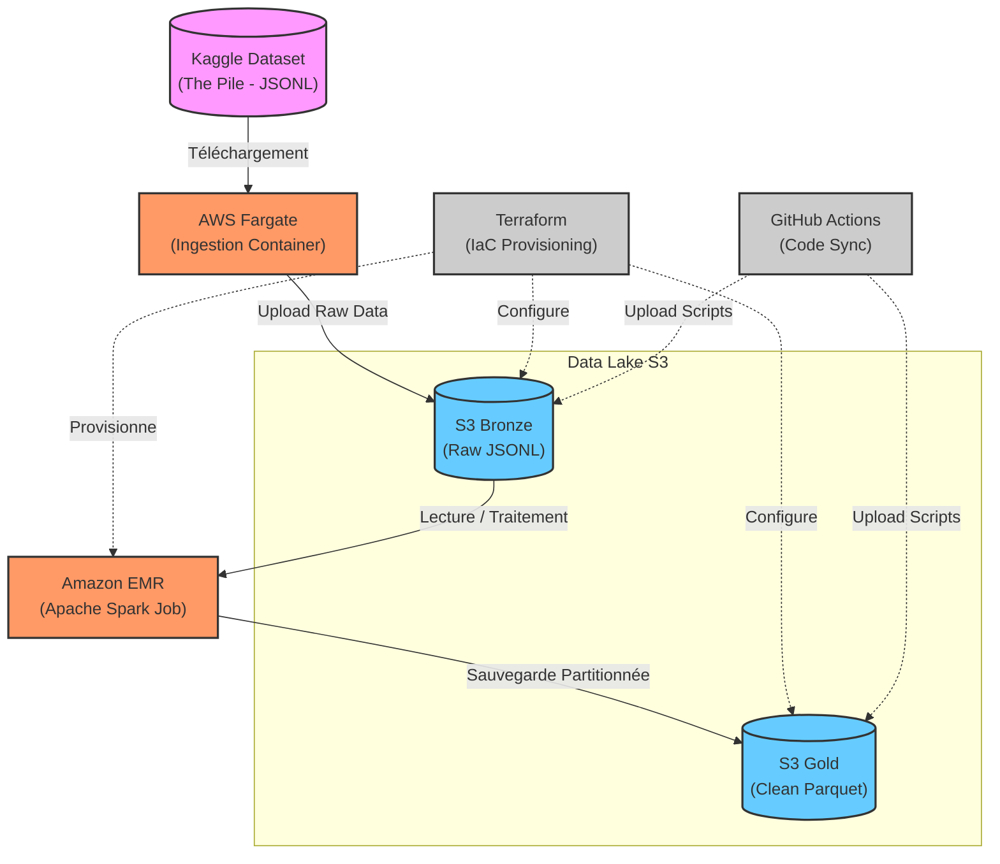
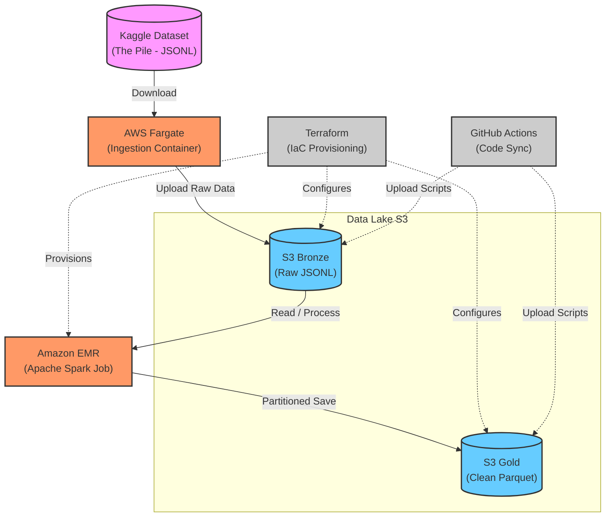

# BigDataEMR_annihilated_by_Polars_Rust

Ce projet illustre le déploiement de bout en bout d'un pipeline Big Data sur AWS. Il intègre le téléchargement de données volumineuses via AWS Fargate, leur stockage sur Amazon S3, et leur traitement distribué avec Apache Spark sur un cluster Amazon EMR provisionné automatiquement par Terraform.

## Sommaire
1. [Architecture](#architecture)
2. [Prérequis](#prérequis)
3. [Structure du Projet](#structure-du-projet)
4. [Installation & Déploiement](#installation--déploiement)
5. [Usage](#usage)
6. [Tests](#tests)
7. [Licence](#licence)
8. [Contact](#contact)

## Architecture

Le pipeline de données est organisé en plusieurs étapes (Architecture Medallion) :



1. **Ingestion (Fargate) -> Bronze (S3)** : Un conteneur s'exécutant sur AWS Fargate télécharge un extrait du dataset *The Pile* (~50Go) depuis Kaggle (format JSONL) et l'upload sur S3. L'utilisation de Fargate est privilégiée à Lambda en raison des limitations de temps de traitement et de ressources de ce dernier.
2. **Bronze -> Silver -> Gold (Spark sur EMR)** : 
   - Nettoyage et conversion des données.
   - Filtrage du texte et partitionnement selon les métadonnées.
   - Les données finales sont stockées sur S3 au format `.parquet`, optimisées et prêtes à être requêtées avec Amazon Athena.
3. **Infrastructure as Code (Terraform)** : Création d'un VPC sécurisé, de sous-réseaux publics/privés, d'un Gateway Endpoint pour S3, des rôles et clés IAM/KMS, et du cluster EMR.

## Prérequis

- AWS CLI installé et configuré
- Credentials AWS configurés en secrets (ID et Rôle)
- Clé d'API Kaggle stockée dans AWS Systems Manager (SSM) paramètre `/kaggle/username` et `/kaggle/key`
- Terraform `v1.5+`
- Python `3.8+`
- Docker (pour l'image Fargate)

## Configuration Terraform

Le projet utilise des fichiers de variables pour faciliter la personnalisation:

- `terraform/variables.tf`: Définitions des variables avec valeurs par défaut
- `terraform/terraform.tfvars`: Vos valeurs de configuration (à créer depuis l'exemple)
- `terraform/terraform.tfvars.example`: Template de configuration
- `terraform/CONFIG.md`: Documentation complète de configuration
- `terraform/KMS_MANAGEMENT.md`: Guide de gestion de la clé KMS
- `terraform/DESTROY_TROUBLESHOOTING.md`: Guide de dépannage pour la destruction

### Fichiers de configuration importants

```bash
terraform/
├── main.tf                          # Infrastructure principale
├── kms.tf                           # Gestion de la clé KMS
├── variables.tf                     # Définitions des variables
├── terraform.tfvars                 # VOS valeurs (à créer)
├── terraform.tfvars.example         # Template
├── CONFIG.md                        # Documentation configuration
├── KMS_MANAGEMENT.md                # Guide KMS
└── DESTROY_TROUBLESHOOTING.md       # Guide dépannage
```

## Structure du Projet

- `code/` : Scripts de transformation PySpark (nettoyage, transformation, partitionnement). Contient également des tests unitaires pour valider les transformations.
- `fargate/` : Script Rust et Dockerfile pour authentifier le compte Kaggle, télécharger les données et les envoyer sur le bucket S3 "Bronze".
- `terraform/` : Fichiers IaC définissant l'infrastructure AWS complète (Réseau, EMR, IAM, Sécurité, etc.).
  - `QUICK_START.md` : Guide de démarrage rapide (5 minutes)
  - `CONFIG.md` : Documentation complète de configuration
  - `KMS_MANAGEMENT.md` : Guide de gestion de la clé KMS
  - `DESTROY_TROUBLESHOOTING.md` : Résolution des problèmes de destruction
  - `FAQ.md` : Questions fréquentes
- `.github/workflows/` : Pipeline CI/CD GitHub Actions pour automatiser la configuration du bucket S3, l'upload des scripts d'exécution et potentiellement le déploiement.

## Installation & Déploiement

### 1. Configuration Terraform

Le projet utilise des variables Terraform pour faciliter la personnalisation. Toutes les valeurs de configuration sont externalisées dans des fichiers `.tfvars`.

#### Configuration initiale

```bash
cd terraform

# Copiez le fichier d'exemple et personnalisez-le
cp terraform.tfvars.example terraform.tfvars

# Éditez terraform.tfvars avec vos valeurs spécifiques
# Notamment: s3_bucket_name, ecr_repository_name, ecr_image_tag, etc.
```

#### Variables principales à configurer

Consultez `terraform/CONFIG.md` pour la documentation complète. Les variables essentielles incluent:

- `s3_bucket_name`: Nom de votre bucket S3 (ex: "sparkresultsjjjmain")
- `ecr_repository_name`: Nom du repository ECR (ex: "emr_fine")
- `ecr_image_tag`: Tag de l'image Docker (ex: "latest15")
- `aws_region`: Région AWS (défaut: "eu-west-3")
- Configuration réseau, ECS, EMR, et Spark

### 2. Fargate (Ingestion)

Construisez et poussez l'image Docker contenant le script d'ingestion vers Amazon ECR :

```bash
# Créer le repository ECR (utilisez le nom configuré dans terraform.tfvars)
aws ecr create-repository --repository-name emr_fine

# Authentification ECR
aws ecr get-login-password --region eu-west-3 | docker login --username AWS --password-stdin <aws_account_id>.dkr.ecr.eu-west-3.amazonaws.com

# Construire l'image
cd fargate
docker build -t emr_fine:latest15 .

# Taguer et pousser l'image
docker tag emr_fine:latest15 <aws_account_id>.dkr.ecr.eu-west-3.amazonaws.com/emr_fine:latest15
docker push <aws_account_id>.dkr.ecr.eu-west-3.amazonaws.com/emr_fine:latest15
```

### 3. Infrastructure (Terraform)

#### Déploiement initial

```bash
cd terraform

# Initialiser Terraform (télécharge les providers)
terraform init

# Vérifier les changements qui seront appliqués
terraform plan

# Appliquer la configuration
terraform apply
```

**Note sur la clé KMS**: La clé KMS sera créée automatiquement lors du premier déploiement. Si une clé existe déjà, Terraform la réutilisera. La clé est protégée contre la suppression accidentelle avec `prevent_destroy = true`.

#### Gestion de la clé KMS existante

Si vous avez déjà une clé KMS et souhaitez l'importer dans Terraform:

```bash
# Importer la clé existante (remplacez par l'ARN de votre clé)
terraform import aws_kms_key.emrb arn:aws:kms:eu-west-3:123456789012:key/12345678-1234-1234-1234-123456789012
```

#### Destruction de l'infrastructure

Pour détruire toutes les ressources **sauf la clé KMS** (qui est protégée):

```bash
cd terraform

# Détruire toutes les ressources sauf la clé KMS
terraform destroy

# Si vous rencontrez des erreurs de dépendances, utilisez:
terraform destroy -refresh=false

# Pour forcer la suppression de ressources spécifiques:
terraform destroy -target=aws_sfn_state_machine.emr_pipeline
terraform destroy -target=aws_emrserverless_application.spark_app
```

**Important**: La clé KMS ne sera jamais détruite par `terraform destroy` grâce à la protection `prevent_destroy`. Pour la supprimer manuellement (si nécessaire):

```bash
# Planifier la suppression de la clé (période d'attente de 7 jours par défaut)
aws kms schedule-key-deletion --key-id <key-id> --pending-window-in-days 7
```

#### Environnements multiples

Pour gérer plusieurs environnements (dev, staging, prod):

```bash
# Créer des fichiers de configuration séparés
cp terraform.tfvars dev.tfvars
cp terraform.tfvars prod.tfvars

# Déployer un environnement spécifique
terraform apply -var-file="dev.tfvars"
terraform apply -var-file="prod.tfvars"
```

### 4. CI/CD

L'utilisation de GitHub Actions (`main.yaml`) automatise la création d'un bucket S3 (s'il n'existe pas) et y place les fichiers contenus dans `code/`.

## 📚 Documentation Terraform

Le dossier `terraform/` contient une documentation complète:

- **[terraform/README.md](terraform/README.md)** - Index de toute la documentation
- **[terraform/QUICK_START.md](terraform/QUICK_START.md)** - Démarrage rapide (5 minutes)
- **[terraform/CONFIG.md](terraform/CONFIG.md)** - Configuration détaillée
- **[terraform/KMS_MANAGEMENT.md](terraform/KMS_MANAGEMENT.md)** - Gestion de la clé KMS
- **[terraform/DESTROY_TROUBLESHOOTING.md](terraform/DESTROY_TROUBLESHOOTING.md)** - Dépannage
- **[terraform/FAQ.md](terraform/FAQ.md)** - Questions fréquentes

### Points Clés

✅ **Variables externalisées**: Toutes les valeurs de configuration sont dans `terraform.tfvars`
✅ **Clé KMS protégée**: Création automatique ou réutilisation d'une clé existante
✅ **Destruction sécurisée**: `terraform destroy` détruit tout sauf la clé KMS
✅ **Documentation complète**: Guides pour tous les scénarios

## Usage

L'objectif de ce travail est de déployer de A à Z un script Spark dans un cluster EMR (Elastic Map Reduce) créé par Terraform.
Une fois l'infrastructure montée par Terraform, le cluster EMR s'initialise, télécharge les scripts depuis S3, exécute le job PySpark et écrit les résultats transformés et partitionnés sur S3.

*Note : L'historique Git des branches a été expurgé volontairement afin de ne pas exposer d'identifiants AWS (bien qu'ils soient désormais externalisés dans des secrets).*

## Tests

Des tests unitaires (TUs) sont inclus dans le dossier `code/` (ex. `test_clean_df.py`) pour s'assurer que les transformations Spark s'exécutent avec succès. Les actions attendues sont notamment le filtrage des lignes trop courtes, le retrait de certains termes de copyright, et la restructuration des colonnes imbriquées.

## Contact

Retrouvez-moi sur [LinkedIn](https://www.linkedin.com/in/n-jandot/)

_________________________________

# BigData EMR & AWS Fargate Project

This project illustrates the end-to-end deployment of a Big Data pipeline on AWS. It integrates the download of large datasets via AWS Fargate, their storage on Amazon S3, and their distributed processing with Apache Spark on an Amazon EMR cluster automatically provisioned by Terraform.

## Table of Contents
1. [Architecture](#architecture-1)
2. [Prerequisites](#prerequisites)
3. [Project Structure](#project-structure)
4. [Installation & Deployment](#installation--deployment)
5. [Usage](#usage-1)
6. [Tests](#tests-1)
7. [License](#license-1)
8. [Contact](#contact-1)

## Architecture

The data pipeline is organized into multiple stages (Medallion Architecture):



1. **Ingestion (Fargate) -> Bronze (S3)**: A container running on AWS Fargate downloads an extract of *The Pile* dataset (~50GB) from Kaggle (JSONL format) and uploads it to S3. Fargate is preferred over Lambda due to the latter's processing time and resource limitations.
2. **Bronze -> Silver -> Gold (Spark on EMR)**: 
   - Data cleaning and conversion.
   - Text filtering and partitioning according to metadata.
   - The final data is stored on S3 in `.parquet` format, optimized and ready to be queried with Amazon Athena.
3. **Infrastructure as Code (Terraform)**: Creation of a secure VPC, public/private subnets, a Gateway Endpoint for S3, IAM/KMS roles and keys, and the EMR cluster.

## Prerequisites

- AWS CLI installed and configured
- AWS Credentials configured as secrets (ID and Role)
- Kaggle API key stored in AWS Systems Manager (SSM) parameters `/kaggle/username` and `/kaggle/key`
- Terraform `v1.5+`
- Python `3.8+`
- Docker (for the Fargate image)

## Terraform Configuration

The project uses variable files to facilitate customization:

- `terraform/variables.tf`: Variable definitions with default values
- `terraform/terraform.tfvars`: Your configuration values (to be created from example)
- `terraform/terraform.tfvars.example`: Configuration template
- `terraform/CONFIG.md`: Complete configuration documentation
- `terraform/KMS_MANAGEMENT.md`: KMS key management guide
- `terraform/DESTROY_TROUBLESHOOTING.md`: Troubleshooting guide for destruction

### Important configuration files

```bash
terraform/
├── main.tf                          # Main infrastructure
├── kms.tf                           # KMS key management
├── variables.tf                     # Variable definitions
├── terraform.tfvars                 # YOUR values (to create)
├── terraform.tfvars.example         # Template
├── CONFIG.md                        # Configuration documentation
├── KMS_MANAGEMENT.md                # KMS guide
└── DESTROY_TROUBLESHOOTING.md       # Troubleshooting guide
```

## Project Structure

- `code/`: PySpark transformation scripts (cleaning, transformation, partitioning). Also contains unit tests to validate the transformations.
- `fargate/`: Rust script and Dockerfile to authenticate the Kaggle account, download the data, and send it to the "Bronze" S3 bucket.
- `terraform/`: IaC files defining the complete AWS infrastructure (Network, EMR, IAM, Security, etc.).
  - `QUICK_START.md`: Quick start guide (5 minutes)
  - `CONFIG.md`: Complete configuration documentation
  - `KMS_MANAGEMENT.md`: KMS key management guide
  - `DESTROY_TROUBLESHOOTING.md`: Troubleshooting for destruction issues
  - `FAQ.md`: Frequently asked questions
- `.github/workflows/`: GitHub Actions CI/CD pipeline to automate the creation of the S3 bucket, uploading execution scripts, and potentially deployment.

## Installation & Deployment

### 1. Terraform Configuration

The project uses Terraform variables to facilitate customization. All configuration values are externalized in `.tfvars` files.

#### Initial configuration

```bash
cd terraform

# Copy the example file and customize it
cp terraform.tfvars.example terraform.tfvars

# Edit terraform.tfvars with your specific values
# Notably: s3_bucket_name, ecr_repository_name, ecr_image_tag, etc.
```

#### Main variables to configure

See `terraform/CONFIG.md` for complete documentation. Essential variables include:

- `s3_bucket_name`: Your S3 bucket name (e.g., "sparkresultsjjjmain")
- `ecr_repository_name`: ECR repository name (e.g., "emr_fine")
- `ecr_image_tag`: Docker image tag (e.g., "latest15")
- `aws_region`: AWS region (default: "eu-west-3")
- Network, ECS, EMR, and Spark configuration

### 2. Fargate (Ingestion)

Build and push the Docker image containing the ingestion script to Amazon ECR:

```bash
# Create the ECR repository (use the name configured in terraform.tfvars)
aws ecr create-repository --repository-name emr_fine

# ECR authentication
aws ecr get-login-password --region eu-west-3 | docker login --username AWS --password-stdin <aws_account_id>.dkr.ecr.eu-west-3.amazonaws.com

# Build the image
cd fargate
docker build -t emr_fine:latest15 .

# Tag and push the image
docker tag emr_fine:latest15 <aws_account_id>.dkr.ecr.eu-west-3.amazonaws.com/emr_fine:latest15
docker push <aws_account_id>.dkr.ecr.eu-west-3.amazonaws.com/emr_fine:latest15
```

### 3. Infrastructure (Terraform)

#### Initial deployment

```bash
cd terraform

# Initialize Terraform (downloads providers)
terraform init

# Check the changes that will be applied
terraform plan

# Apply the configuration
terraform apply
```

**Note on KMS key**: The KMS key will be created automatically during the first deployment. If a key already exists, Terraform will reuse it. The key is protected against accidental deletion with `prevent_destroy = true`.

#### Managing existing KMS key

If you already have a KMS key and want to import it into Terraform:

```bash
# Import the existing key (replace with your key's ARN)
terraform import aws_kms_key.emrb arn:aws:kms:eu-west-3:123456789012:key/12345678-1234-1234-1234-123456789012
```

#### Infrastructure destruction

To destroy all resources **except the KMS key** (which is protected):

```bash
cd terraform

# Destroy all resources except the KMS key
terraform destroy

# If you encounter dependency errors, use:
terraform destroy -refresh=false

# To force deletion of specific resources:
terraform destroy -target=aws_sfn_state_machine.emr_pipeline
terraform destroy -target=aws_emrserverless_application.spark_app
```

**Important**: The KMS key will never be destroyed by `terraform destroy` thanks to the `prevent_destroy` protection. To manually delete it (if necessary):

```bash
# Schedule key deletion (7-day waiting period by default)
aws kms schedule-key-deletion --key-id <key-id> --pending-window-in-days 7
```

#### Multiple environments

To manage multiple environments (dev, staging, prod):

```bash
# Create separate configuration files
cp terraform.tfvars dev.tfvars
cp terraform.tfvars prod.tfvars

# Deploy a specific environment
terraform apply -var-file="dev.tfvars"
terraform apply -var-file="prod.tfvars"
```

### 4. CI/CD

Using GitHub Actions (`main.yaml`) automates the creation of an S3 bucket (if it doesn't exist) and places the files from `code/` into it.

## 📚 Terraform Documentation

The `terraform/` folder contains complete documentation:

- **[terraform/README.md](terraform/README.md)** - Index of all documentation
- **[terraform/QUICK_START.md](terraform/QUICK_START.md)** - Quick start (5 minutes)
- **[terraform/CONFIG.md](terraform/CONFIG.md)** - Detailed configuration
- **[terraform/KMS_MANAGEMENT.md](terraform/KMS_MANAGEMENT.md)** - KMS key management
- **[terraform/DESTROY_TROUBLESHOOTING.md](terraform/DESTROY_TROUBLESHOOTING.md)** - Troubleshooting
- **[terraform/FAQ.md](terraform/FAQ.md)** - Frequently asked questions

### Key Points

✅ **Externalized variables**: All configuration values are in `terraform.tfvars`
✅ **Protected KMS key**: Automatic creation or reuse of existing key
✅ **Safe destruction**: `terraform destroy` destroys everything except the KMS key
✅ **Complete documentation**: Guides for all scenarios

## Usage

The goal of this work is to end-to-end deploy a Spark script in an EMR (Elastic Map Reduce) cluster created by Terraform.
Once the infrastructure is built by Terraform, the EMR cluster initializes, downloads the scripts from S3, executes the PySpark job, and writes the transformed and partitioned results back to S3.

*Note: The Git branch history has been intentionally removed so as not to expose AWS credentials (although they are now externalized in secrets).*

## Tests

Unit tests are included in the `code/` folder (e.g., `test_clean_df.py`) to ensure the Spark transformations run successfully. Expected actions include filtering out short lines, removing certain copyright terms, and restructuring nested columns.

## Contact

Find me on [LinkedIn](https://www.linkedin.com/in/n-jandot/)
